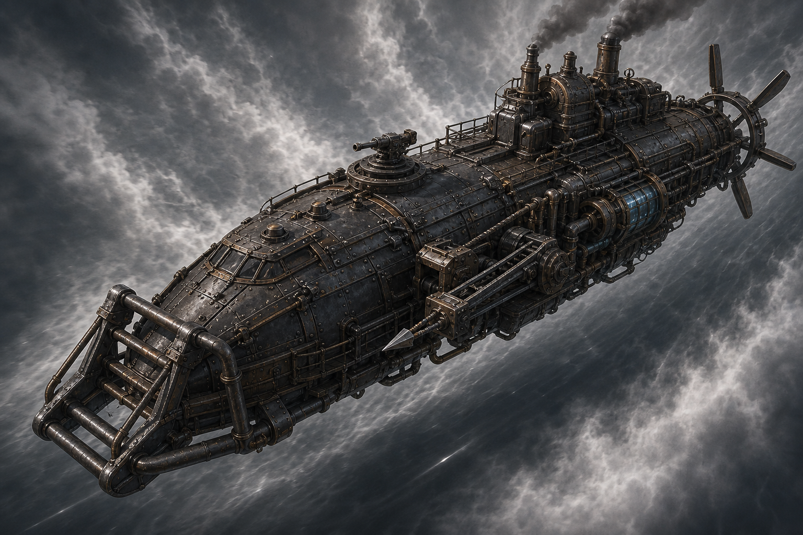
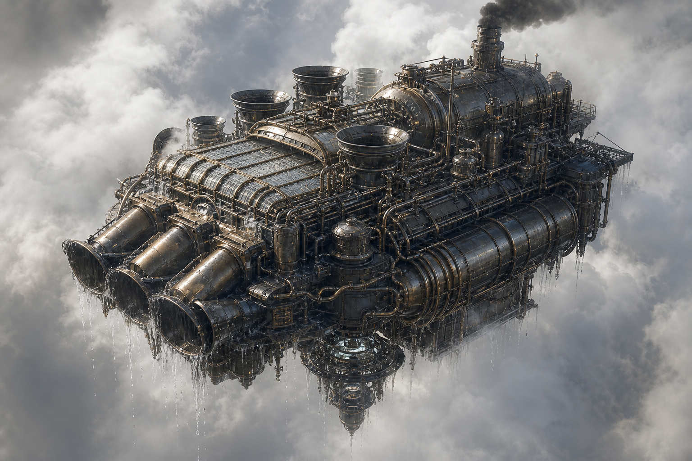
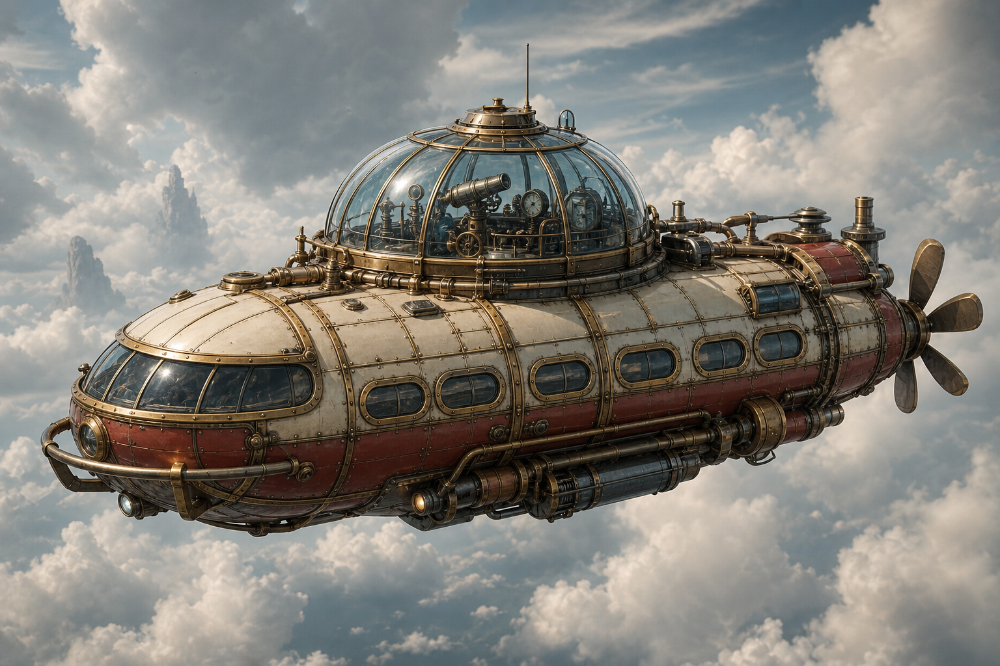

# Матрица ролей и рангов кораблей

Черновик баланса для текущей малой шкалы Wild Wind: **прототип**, **катер**, **тендер**, **корвет**, **фрегат**, **эсминец**, **крейсер**, **линкор**, **капитал**. Цель документа - задать понятную эволюцию функций, чтобы корабли росли не только в тоннах и мощности, но и в роли внутри экономики.

## Базовые ранги

| Ранг | Класс | Длина | Примерный габарит | Масса при 100 кг/м3 | Базовый экипаж | Смысл ранга |
|---|---|---:|---:|---:|---:|---|
| R0 | Прототип | 4-6 м | малый стартовый корпус | до 2-3 т | 1 | Учебный стартовый корабль. |
| R1 | Катер | 8 м | 8 x 2,7 x 2,7 м | 5,7 т | 1 | Одноместный рабочий корабль: вода, руда, разведка, охота, пассажиры. |
| R2 | Тендер | 13,6 м | 13,6 x 4,5 x 4,5 м | 28 т | 3 | Служебная поддержка катеров: ремонт, фургон, кран, снабжение. |
| R3 | Корвет | 23,2 м | 23,2 x 7,7 x 7,7 м | 138 т | 6 | Первый самостоятельный малый корабль с экипажем и несколькими отсеками. |
| R4 | Фрегат | 39,4 м | 39,4 x 13,1 x 13,1 м | 680 т | 15 | Автономная рабочая единица для островной экономики. |
| R5 | Эсминец | 67 м | 67 x 22,3 x 22,3 м | 3340 т | 40 | Военный/промышленный корабль с несколькими подсистемами. |
| R6 | Крейсер | 114 м | 114 x 38 x 38 м | 16500 т | 120 | Региональный корабль, который сам создает сервис вокруг себя. |
| R7 | Линкор | 194 м | 194 x 64,7 x 64,7 м | 81000 т | 350 | Тяжелый корабль флота, требует постоянной логистики и сервиса. |
| R8 | Капитал | 330 м | 330 x 110 x 110 м | 399000 т | 1000 | Летающая инфраструктура: док, порт, сервисный узел или флотский центр. |

Эти числа - новая корпусная шкала рангов. Она считает корабль как грубый прямоугольный ориентир, где длина примерно в 3 раза больше ширины и высоты, а ширина и высота примерно равны. Это не сетка отсеков и не финальный силуэт.

Средние корпусные плотности:

| Тип корабля | Плотность |
|---|---:|
| Лёгкий и хрупкий | 50 кг/м3 |
| Обычный | 100 кг/м3 |
| Тяжёлый, бронированный или нагруженный оборудованием | 200 кг/м3 |

Масса в таблице выше дана для обычного корабля при 100 кг/м3. Для лёгкой версии её можно примерно делить на 2, для тяжёлой - умножать на 2.

Старые конкретные массы и мощности кораблей ниже по документу считаются черновыми до отдельного пересчёта под новую размерную шкалу.

Актуальная ранняя линейка:

- R0 Пионер - бесплатный универсальный грузовой корабль на 400 кг.
- R1 катера: Водомерка собирает воду, Булат ловит падающие обломки руды противоударным кузовом, Шершень ведёт разведку, Егерь работает гарпуном, Паровоз возит людей.
- R2 тендеры: Опора даёт ремонт и снабжение, Вахта - рабочую силу и медицину, Фургонщик - быстрый защищённый универсальный груз, Стапель - мобильный док.
- Топливщик, Жидковоз и Глетчер выведены из актуальной ранней линейки.

## T-уровни кораблей

R-ранг задаёт физический класс корпуса: массу, экипаж, размер, доки и базовую роль. T-уровень задаёт технологическое поколение корабля: материалы, сложность систем, доступные подсистемы и производственную цепочку.

T-уровень не заменяет ранг. Один и тот же класс корпуса может существовать в нескольких технологических поколениях, но диапазон поколений ограничен размером корабля.

| T / R | R1 Катер | R2 Тендер | R3 Корвет | R4 Фрегат | R5 Эсминец | R6 Крейсер | R7 Линкор | R8 Капитал |
|---|---|---|---|---|---|---|---|---|
| T1 | да | да |  |  |  |  |  |  |
| T2 | да | да | да | да |  |  |  |  |
| T3 |  | да | да | да | да | да |  |  |
| T4 |  |  |  | да | да | да | да |  |
| T5 |  |  |  |  | да | да | да | да |

Короткое чтение матрицы:

- R1 Катер: T1-T2.
- R2 Тендер: T1-T3.
- R3 Корвет: T2-T3.
- R4 Фрегат: T2-T4.
- R5 Эсминец: T3-T5.
- R6 Крейсер: T3-T5.
- R7 Линкор: T4-T5.
- R8 Капитал: только T5.

### Что означает окно R/T

Матрица R/T показывает не физическую возможность и не обязательный список контента, а окно нормальных серийных проектов. Внутри окна корабль считается экономически, технологически и производственно разумным для мира. Вне окна корабль может существовать только как исключение: прототип, рекордная машина, сюжетная руина, артефакт, уникальный заказ или катастрофически неэффективная конструкция.

Нижняя граница T для большого R нужна потому, что крупный корпус - это не просто много материала. Большому кораблю требуются распределённый подъёмный контур, аварийные системы, ремонтопригодность, управление вибрацией, стандартизация узлов, экипажная инфраструктура и логистика. T1 может построить большую баржу или опасную чудо-платформу, но не нормальный серийный линкор.

Верхняя граница T для малого R нужна потому, что дорогая технология должна окупать массу, цену и сложность. T4-катер возможен как уникальный разведчик, курьер, лабораторный прототип или спецмашина, но не как штатный массовый корабль: логические узлы автоматонов и высшие материалы обычно разумнее поставить во фрегат, эсминец или крейсер.

Правила чтения:

- если комбинация R/T даёт новую роль или новый способ играть, она может стать отдельным кораблём;
- если комбинация даёт только небольшой прирост к старому кораблю, это модернизация, риг или модуль;
- если T слишком высокий для малого R, это уникальный прототип, а не серийная линейка;
- если R слишком высокий для низкого T, это руина, баржа или опасный эксперимент, а не нормальный класс флота;
- если соседний ранг уже делает ту же работу понятнее, клетку не нужно заполнять.

T0 - отдельный страховочный уровень только для Пионера. Это самая базовая и слабая лодка, которую игрок может получать бесплатно в любых количествах. T0 не участвует в основной матрице и нужен, чтобы игрок никогда не оставался без минимального корабля.

R0 Прототип пока остаётся учебной категорией для такого Пионера и не считается полноценным производственным рангом.

Правило маркировки ресурсов и компонентов: T-метка показывает, для корабля какого T-уровня ресурс впервые нужен как отдельная строка рецепта. T1 - набор для T1-кораблей, T2 - новые входы для T2-кораблей, T3 - новые входы для T3-кораблей и так далее. Рецепты старших кораблей могут продолжать потреблять материалы младших уровней как базу, но новые материалы старшего уровня не должны просачиваться вниз.

T1 - базовые производственные корабли. Их рецепты используют только материалы T1-кораблей: медь, железо, магний, уголь и кварц. Для T1 не нужны промежуточные компоненты, сложные переработки или специальные промышленные цепочки: верфь берёт базовые материалы и строит корпус. Корветов T1 больше нет: R3 и выше начинаются с промышленного уровня T2.

T2 - первые промышленные корабли. Их рецепты вводят материалы T2-кораблей и T2-компоненты: добываемые минералы, фермерские материалы, служебные ресурсы и крупные промышленные узлы. T2-компоненты собираются в Manufacturing из базовых компонентов и T2-материалов, чтобы рецепты кораблей читались крупными узлами, а не только тысячами балок и трубок.

T3 - продвинутые корабли и апгрейды. T3 вводит материалы T3-кораблей: реакторные сплавы, керамики, композиты, полимеры, смазки, пасты, младшие газы и материалы левиафанов. Поэтому всё, что впервые нужно в Reaction для T3-рецепта, считается T3-материалом, а не T2.

### Новая постройка и модернизация

По умолчанию корабль строится с нуля из материалов и компонентов своего T-уровня. Готовый корабль прошлого тира не нужен просто потому, что новый рецепт старше.

Готовый корабль прошлого тира требуется только для модернизации, если новая версия явно является тем же корпусом, той же ролью и тем же рангом. Такой рецепт считается рефитом: он дешевле и быстрее новой постройки, сохраняет историю корабля, но требует исправный базовый корабль.

Критерии модернизации:

- та же роль: водосборщик остаётся водосборщиком, разведчик остаётся разведчиком;
- тот же R-ранг и близкий силуэт корпуса;
- название и фантазия читаются как "старая машина получила новый комплект", а не "построен новый класс";
- рецепт меняет узлы, контур, автоматику, защиту или эффективность, но не превращает корабль в другую профессию;
- допустимый износ перед рефитом задаётся балансом, ориентир - лучше 70-80% ресурса корпуса.

Критерии новой постройки:

- меняется R-ранг или масштаб корпуса;
- роль меняется радикально;
- корабль должен выглядеть как новая машина, а не как переделка старой;
- рецепт относится к новому классу флота, например переход от корвета к фрегату.

Примеры: T1-Водомерка -> T2-Водомерка может быть модернизацией; T2-Горизонт -> T3-Горизонт - модернизация; T2-Кувалда -> R4/T2-Крушитель - новая постройка, потому что это другой ранг и корпус. T4 и T5 обычно строятся как новые технологические поколения, а не требуют скармливать корабль прошлого тира, кроме явно описанных рефитов внутри той же роли и ранга.

### Отсеки, свободные слоты и улучшения

Корабли не должны быть полностью свободной коробкой под любой фит. Корпус задаёт роль, обязательные отсеки и вшитые рабочие системы. Свободные слоты нужны для стиля рейса, а не для превращения корабля в другой класс.

Склады не считаются отсеками. Полезная нагрузка, фургон, цистерна, бак, грузовое место, запас топлива, запас воды и запас расходников идут в характеристики массы, автономности и вместимости. Отсек - это рабочее помещение или функциональная зона: там есть люди, станки, пост управления, обработка, ремонт, медицина, столовая или другая активная работа.

### Сетка палуб и унификация отсеков

Катера и тендеры не используют палубную сетку и не имеют свободных рабочих отсеков. Это цельные малые корпуса: рубка, кузов, бак, салон, кран, доковая арка, кухня или медпост считаются встроенными узлами роли, а не переставляемыми отсеками.

Начиная с корветов, палуба имеет фиксированную высоту внутри своего типоразмера. Если кораблю не хватает внутреннего объёма, он получает больше палуб, а не более высокие "особые" палубы. Рабочие отсеки унифицированы не по метрам, а по типоразмеру: малый отсек корвета и большой отсек титана могут выполнять похожую функцию, но это разные физические изделия, рецепты и мощности.

Палубная сетка - это боковой 2D-интерфейс компоновки, а не чертёж корпуса. Габариты корабля не выводятся из числа ячеек. Сначала задаются корпус, роль, масса, силовая установка, бур/пушка/доки/баки/обвес и силуэт; потом внутри этого корпуса отмечается сетка рабочих отсеков. Ось X интерфейса идёт по длине корпуса, ось Y - по палубам. Ширина корабля не является координатой сетки, не рисуется в интерфейсе и не увеличивает число ячеек. Одна палуба - это один ряд ячеек по длине; если нужна вертикальная стопка, это следующая палуба.

Типоразмеры ячеек:

| Типоразмер | Ранги | Размер ячейки боковой сетки | Шаг палубы в интерфейсе | Смысл |
|---|---|---:|---:|---|
| Малый | R3 корветы, R4 фрегаты | 5 x 5 м | 5 м | первые корабельные помещения: посты, малые мастерские, рубки, приёмные. |
| Средний | R5 эсминцы, R6 крейсера | 10 x 10 м | 10 м | полноценные цеховые и сервисные помещения, крупные посты, тяжёлые машинные зоны. |
| Большой | R7 линкоры, R8 титаны/капиталы | 20 x 20 м | 20 м | секции корабля-инфраструктуры: госпитальные, доковые, производственные и жилые блоки. |

Размер ячейки указан для боковой 2D-сетки: X идёт по длине корпуса, Y - по палубам. Ширина корабля не является координатой сетки. Размер ячейки нужен для ощущения масштаба отсека и рецептов, но не суммируется в длину корабля. Например 9 ячеек на палубе не означают, что корпус обязан иметь ровно 9 шагов без носа, кормы, рам, баков и внешних систем.

Обычный рабочий отсек занимает от 1 до 3 ячеек своего типоразмера. Если система крупнее, она считается не одним отсеком, а встроенной ролевой системой корабля: буровой тракт, дробильная линия, дроновые шахты, доковая арка, газозаборный тракт. Такие системы могут занимать много ячеек и несколько палуб, но свободным отсеком не считаются.

Сетка рабочих отсеков не обязана совпадать с полным силуэтом корабля. Носовая пушка, кузов, баки, винты, фермы, доковая арка, внешние рамы, заборники и другой обвес могут выступать за сетку. Форма сетки по палубам может быть рваной: например 3 ячейки на одной палубе, 1 на следующей и 3 ещё ниже, если так лучше ложится в корпус и роль.

Ориентир по рангу:

| Ранг | Типоразмер | Встроенные ячейки | Свободные ячейки | Смысл |
|---|---|---:|---:|---|
| R0-R1 | нет | нет | нет | катер: цельный корпус без свободных отсеков. |
| R2 | нет | нет | нет | тендер: цельная служебная машина без свободных отсеков. |
| R3 | малый | 5-8 | 0-2 | корвет: первые нормальные внутренние помещения. |
| R4 | малый | 10-16 | 1-4 | фрегат: автономность, столовая, несколько рабочих слотов. |
| R5 | средний | 18-28 | 3-8 | эсминец: несколько палубных зон и тяжёлое оборудование. |
| R6 | средний | 35-50 | 8-16 | крейсер: региональный сервис и несколько крупных систем. |
| R7 | большой | 60-85 | 20-35 | линкор: тяжёлая флотская инфраструктура. |
| R8 | большой | 100 | 60 | титан/капитал: летающий город, порт, док или промышленная база. |

Проектная сетка текущих кораблей. Это сетка рабочих отсеков, а не полный габарит корпуса.

| Корабль | Класс | Ячеек на палубе | Палуб | Итого ячеек | Примечание |
|---|---|---:|---:|---:|---|
| Пионер, Водомерка, Булат, Шершень, Егерь, Паровоз | R0-R1 | нет | нет | нет | катера без палуб и свободных отсеков. |
| Опора, Вахта, Фургонщик, Стапель | R2 | нет | нет | нет | тендеры без палуб и свободных отсеков; их роль задаётся встроенными узлами. |
| Кувалда | R3 | 4 / 4 | 2 | 8 | подтверждено: боковая сетка меньше полного силуэта из-за пушки, приёмника, кузова, баков и силовой рамы. |
| Борзый | R3 | 4 / 4 | 2 | 8 | укладывается как плотный охотничий корвет: рубка, машина, гарпунный, боевой и промысловый посты. |
| Гонец | R3 | 3 / 3 | 2 | 6 | компактный курьер; грузовое место не считается отсеком. |
| Каптаж | R3 | 4 / 4 | 2 | 8 | тяжёлый корвет на верхней границе R3; баки, заборники и решётки остаются внешними системами. |
| Горизонт | R3 | 3 / 3 | 2 | 6 | лёгкий разведчик; купол и приборный обвес не раздувают сетку отсеков. |
| Крушитель / Крушитель-М | R4 | 5 / 5 / 4 | 3 | 14 | 12 встроенных малых ячеек и 2 свободные; у Крушителя-М свободные уходят под опасный рефит. |
| Триада | R4/T4 | 7 / 6 / 4 | 3 | 17 | 16 встроенных малых ячеек и 1 свободная; фрегат-носитель трёх тяжёлых добывающих дронов. |
| Расскол | R5 | 9 / 9 / 9 | 3 | 27 | 22 встроенные средние ячейки и 5 свободных; средняя палуба целиком занята буровым трактом. |

Слои компоновки:

- вшитая роль корпуса: мостик, силовой блок, подъёмный контур, рудный приёмник, дробилка, газозабор, гарпунный пост или другая система, без которой корабль перестаёт быть собой;
- свободные рабочие отсеки: ремонтный пост, наблюдательный пост, защитный пост, усиленный насосный пост, фильтровальный пост, аварийный медпункт, мастерская, операторская;
- улучшения узлов и отсеков: двигатель, контур, дробилка, обшивка, автоматика, баки, медпункт, столовая, разведка, фильтрация, защита, доковый пост.

Для кораблей с палубной сеткой свободные ячейки должны расти по рангу. Меньше не даёт игроку выбора, больше быстро превращает корабль в таблицу оптимизации и ведёт к одному метовому фиту.

Встроенные ролевые отсеки улучшаются как часть корабля. Например, у рудного корабля улучшаются дробилка, рудный приёмник, сбросные лотки и защита кузова. Это не свободные модули выбора, а сердце роли.

Свободные отсеки должны иметь варианты, а не только линейное "I-V лучше". Например, ремонтный пост может быть лёгким, мастерским, аварийным или автоматонным. Лёгкий мало весит, мастерская требует экипаж и инструменты, аварийный пост быстро гасит критические поломки, автоматонный экономит экипаж, но требует salvage и обслуживание.

Каждый отсек и апгрейд должен тратить лимиты корабля: массу, мощность, экипаж, служебный запас, иногда стабильность, воду, еду, медикаменты, инструменты или редкие расходники. Лучший по одной цифре отсек не должен быть лучшим для каждого рейса.

T-уровень корабля ограничивает потолок штатных отсеков. T2-корабль может ставить T2-отсеки и отдельные простые T3-рефиты, но полноценные T4-автоматонные отсеки на нём считаются уникальным прототипом или дорогим костылём, а не нормальной серийной сборкой.

Не каждый отсек обязан иметь прокачку. Улучшения нужны только там, где они меняют геймплей: добыча, ремонт, медицина, столовая, разведка, фильтрация, защита, автоматика, доки и роль корабля.

Итоговое правило: корпус задаёт роль, свободные отсеки задают стиль рейса, улучшения отсеков задают специализацию внутри этого стиля.

### T2-материалы для T2-кораблей

T2-материалы не требуют крафта в стиле "сделай материал из нескольких других материалов". Кальцит, сильвин и монацит добываются из своих руд или залежей. Фермерские материалы производятся фермерским циклом и требуют только воду как вход региона.

| Материал | Источник | Требование | Для чего |
|---|---|---|---|
| Кальцит | кальцитовая/карбонатная руда | добывается из руды, без крафта | жёсткость, жаростойкость, крупные рамы. |
| Сильвин | сильвиновая руда, калиевая соль | добывается из руды, без крафта | подшипники, редукторы, клапанная точность. |
| Монацит | монацитовая руда или россыпь | добывается из руды, драгоценный материал | приборы, настройки контура, дорогая точность. |
| Каучук | фермерский ресурс | вода | герметичность, прокладки, амортизация. |
| Ткань | фермерский ресурс | вода | фильтры, экипажные блоки, мягкие оболочки. |
| Бумага | фермерский ресурс | вода | чертежи, карты, инструкции, исследования. |
| Спирт | фермерский ресурс | вода | топливо, очистка, простая химия. |
| Еда | фермерский ресурс | вода | экипаж, вахты, автономность. |
| Медикаменты | фермерский санитарный ресурс | вода | здоровье экипажа, санитарные корабли. |

### T2-компоненты для T2-кораблей

T2-компоненты - это первые крупные промышленные узлы для T2-кораблей. Они всё ещё собираются без Reaction, но уже требуют T2-материалы и лучше показывают назначение корабля.

| Компонент | Рецепт на 1 шт. | Для чего |
|---|---|---|
| Усиленная балка | балка 6 + ферма 2 + кальцит 2 + сильвин 1 | большие рамы, фермы, силовые связи. |
| Герметичная обшивка | обшивка 5 + лист 2 + каучук 3 + ткань 1 | газ, цистерны, высота, защищённые палубы. |
| Подшипниковый узел | шестерни 4 + сильвин 2 + спирт 1 | двигатели, лебёдки, дробилки, насосы. |
| Клапанный блок | клапан 4 + трубки 3 + монацит 1 + каучук 1 | котлы, газ, насосы, безопасная подача. |
| Теплообменник | трубки 6 + лист 3 + кальцит 2 + спирт 1 | пар, конденсаторы, реакторы Жарника. |
| Усиленный бак | бак 4 + лист 3 + каучук 3 + кальцит 1 | топливо, клавдий, вода, газовый конденсат. |
| Редуктор | шестерни 5 + ферма 2 + сильвин 2 + спирт 1 | винты, лебёдки, рулевые машины, дробилки. |
| Фильтровальный блок | трубки 2 + клапан 1 + кварц 4 + ткань 2 + бумага 2 | вода, газ, медицина, чистый воздух. |
| Приборный комплект | трубки 2 + кварц 4 + бумага 4 + монацит 1 | разведка, мостики, автоматика раннего уровня. |
| Рабочий модуль | инструменты 4 + балка 3 + лист 2 + ткань 2 + бумага 1 | мастерские, палубные посты, промышленные корабли. |
| Экипажный блок | ткань 6 + бумага 3 + еда 5 + медикаменты 2 + каучук 1 | вахта, пассажиры, автономность, санитарные зоны. |
| Рудный приёмник | усиленная балка 2 + обшивка 6 + бак 2 + кальцит 2 | рудные корабли, противоударные кузова. |
| Дробильный барабан | редуктор 2 + усиленная балка 3 + клапанный блок 1 + сильвин 4 | бортовая дробилка, снижение пустой породы. |
| Газовый конденсатор | теплообменник 1 + фильтровальный блок 2 + усиленный бак 2 + каучук 4 + монацит 2 | сбор облаков, первичная стабилизация газа. |
| Гарпунная лебёдка | редуктор 1 + усиленная балка 1 + шестерни 4 + каучук 2 + сильвин 1 | охота, буксировка, удержание туши или глыбы. |

### T3-компоненты для T3-кораблей

T3-компоненты собираются из T2-компонентов и T3-материалов и впервые нужны в рецептах T3-кораблей. Они должны ощущаться как качественный апгрейд узлов, а не как просто больше сырья.

| Компонент | Рецепт на 1 шт. | Примерный вес | Для чего |
|---|---|---:|---|
| Силовой узел | усиленная балка 2 + редуктор 1 + газовая сталь 5 | 90 кг | Рама, стыки корпуса, крепления тяжёлых систем. |
| Броневой пакет | герметичная обшивка 2 + газовая сталь 5 + панцирный композит 5 + кварцевая керамика 2 | 95 кг | Защита котла, баков, рубки и опасных отсеков. |
| Котёл высокого давления | усиленный бак 1 + клапанный блок 2 + теплообменник 1 + газовая сталь 6 + кварцевая керамика 4 | 140 кг | Пиковая паровая силовая установка. |
| Паровой насос | клапанный блок 1 + подшипниковый узел 1 + медистый сплав 4 + газовый полимер 3 + ихорная смазка 1 | 105 кг | Подача воды, топлива, кислоты, ихора и технических жидкостей. |
| Паровой компрессор | усиленный бак 1 + клапанный блок 2 + подшипниковый узел 1 + медистый сплав 5 + газовая сталь 3 | 150 кг | Давление, сжатый газ, усиленная подача пара. |
| Точный редуктор | редуктор 1 + подшипниковый узел 1 + медистый сплав 3 + ихорная смазка 1 + монацитовая паста 1 | 85 кг | Передачи, лебёдки, рулевые машины, приводы. |
| Рулевой привод | редуктор 1 + клапанный блок 1 + медистый сплав 2 + газовый полимер 2 + монацитовая паста 1 | 85 кг | Рули, тяги, стабилизаторы, манёвры. |
| Механический регулятор | приборный комплект 1 + клапанный блок 1 + монацитовая паста 2 + ихорная смазка 1 | 55 кг | Автоподдержка давления, оборотов, тяги и режима работы. |
| Подъёмный стабилизатор | герметичная обшивка 1 + клапанный блок 1 + лёгкий магнид 5 + монацитовая паста 2 + газовый полимер 2 | 65 кг | Клавдиевый контур, удержание высоты, снижение дрожания. |
| Газовый сепаратор | газовый конденсатор 1 + фильтровальный блок 1 + кварцевая керамика 4 + газовый полимер 3 + монацитовая паста 1 | 90 кг | Разделение низших газов и чистая перегонка. |

### T3-материалы для T3-кораблей

| Материал | Рецепт на 10 ед. | Вес 1 ед. | Для чего |
|---|---|---:|---|
| Газовая сталь | железо 8 + уголь 2 + Жарник 4 + кальцит 1 | 7 кг | Прочные рамы, балки, силовые узлы. |
| Лёгкий магнид | магний 8 + кварц 2 + Суховей 4 + монацит 1 | 2.4 кг | Лёгкие фермы, обшивка, быстрые корабли. |
| Медистый сплав | медь 7 + сильвин 2 + Тихарь 3 + кальцит 1 | 7.8 кг | Теплообменники, трубки, точная паровая арматура. |
| Кварцевая керамика | кварц 7 + кальцит 2 + кислота 2 | 2.9 кг | Жаростойкие вкладыши, изоляторы, реакционные камеры. |
| Панцирный композит | шкура 2 + каучук 3 + кальцит 2 + Тихарь 3 | 2 кг | Защитные панели, герметичные переборки. |
| Газовый полимер | каучук 8 + Жарник 4 + спирт 2 | 1.1 кг | Шланги, прокладки, амортизаторы, гибкие соединения. |
| Ихорная смазка | ихор 5 + жир 4 + Тихарь 2 | 0.95 кг | Редукторы, клапаны, точная механика. |
| Монацитовая паста | монацит 3 + кварц 4 + спирт 2 | 1.8 кг | Точные приборы, контуры, дорогие настройки. |

T4 - корабли высших материалов и автоматонной точности. Их рецепты вводят материалы T4-кораблей: высшие газы, продвинутые реакционные материалы, логические узлы автоматонов и T4-компоненты. Они не требуют готовый T3-корабль как основу: T4 строится как отдельное технологическое поколение. Корветов T4 нет: R3 заканчивается на T3.

### T4-компоненты для T4-кораблей

T4-компоненты впервые используют высшие газы, обычный salvage автоматонов и логические узлы как штатный промышленный слой. Это уже не просто прочные детали, а точные управляющие системы, дроновые узлы, стабилизаторы и сенсорика.

Обычный salvage автоматонов может заменить крафтовые компоненты на складе: реле, катушки, линзы, пружины, шестерни, приводы, пластины и похожие детали. Логические узлы работают иначе: они не крафтятся в цехах и должны прийти из разборки автоматонов, руин или экспедиций.

Добывающие дроны в этом разделе - отдельные собираемые бортовые машины, а не сырьевой ресурс и не найденный целиком автоматонный модуль. При строительстве корабля они входят внутрь общего каскада корабля как вложенные подсборки. Если дрон потерян или списан после аварии, замену можно строить отдельным заказом по тому же рецепту, без постройки нового корабля.

| Компонент | Рецепт на 1 шт. | Для чего |
|---|---|---|
| Добывающий дрон | сервошарнир 2 + пневмоцилиндр 1 + калибровочная шестерня 2 + реле 2 + оптическая линза 1 + газовый полимер 2 + аэрофан 2 | Точная добыча у поверхности глыбы без обрушения руды. |
| Дроновая док-ячейка | сплавная балка 2 + броневая пластина 2 + реле 4 + катушка 2 + контактная гребенка 4 + изолон 3 | Хранение, зарядка, запуск и прием добывающего дрона. |
| Резонансный сканер | приборный комплект 2 + оптический вычислитель 1 + оптическая линза 4 + фокусная призма 2 + резонит 4 + спектрон 3 + монацитовая паста 2 | Поиск древних залежей, карманов, хрупких жил и внутренних границ глыбы. |
| Автоматонный управляющий блок | командный цилиндр 1 + памятный барабан 2 + синхронный регулятор 1 + реле 6 + контактная гребенка 8 + фарадон 4 + резонит 2 | Координация роя, удержание протокола добычи, безопасная остановка дронов. |
| Клавиронный стабилизатор контура | подъемный стабилизатор 1 + резонансный контроллер 1 + гироскоп 2 + маятниковый регулятор 2 + клавирон 4 + изолон 2 | Удержание фрегата рядом с глыбой во время долгой точной добычи. |
| Тяжёлый добывающий дрон | добывающий дрон 4 + автоматонный управляющий блок 1 + сервоядро 1 + сервошарнир 4 + пневмоцилиндр 2 + броневая пластина 2 + конденсаторная банка 1 + термалон 2 + аэрофан 4 | Крупный добывающий дрон эсминца: сам держится на глыбе, режет каналы и несет защиту от опасной руды. |
| Тяжёлая дроновая док-ячейка | дроновая док-ячейка 4 + сплавная балка 4 + броневая пластина 4 + гироскоп 1 + клавирон 3 + изолон 4 | Ангарная люлька, зарядка, ремонт и фиксация крупного добывающего дрона. |

T5 - корабли из крупных подсистем. Их рецепты вводят материалы T5-кораблей: субликаты, предтечевые/городские узлы и крупные подсистемы. Сначала из изделий высших материалов, логических узлов автоматонов и субликатов собираются сложные подсистемы. Уже из набора этих подсистем строится T5-корабль.

### Эталонный T1-рецепт: Водомерка

Водомерка - R1/T1 катер для примитивного сбора воды из облаков. T1-рецепт использует только базовые материалы младших глыб, без промежуточных компонентов и без специальных производственных цепочек.

Одна единица ресурса в рецептах кораблей примерно равна 1 дм3 материала.

| Ресурс | Количество | Примерная масса | Роль в корабле |
|---|---:|---:|---|
| Железо | 180 | 1420 кг | Рама, крепления, котёл. |
| Магний | 300 | 510 кг | Лёгкая обшивка, баки, фермы. |
| Медь | 50 | 450 кг | Трубы, насосы, теплообменник. |
| Кварц | 100 | 265 кг | Конденсатор, фильтры, приборные стёкла. |
| Уголь | 70 | 90 кг | Топка, стартовый запас, футеровка. |

Итого: 700 единиц сырья, примерно 2735 кг. Это подходит под текущую сухую массу Водомерки около 2,5 т: часть массы уходит в отходы, обрезь, крепёжный запас и технологические потери.

Клавдий для T1-кораблей считается не строительным ресурсом, а эксплуатационной заправкой и настройкой подъёмного контура.

### Базовые компоненты из T1-материалов

Базовые компоненты делаются только из материалов T1-кораблей: железа, меди, магния, угля и кварца. Они не делают T1-корабль сложнее, пока не стоят отдельной строкой в его рецепте; в текущей шкале они впервые используются как удобная база для T2-компонентов. Рецепты ниже указаны на 10 единиц компонента.

| Компонент | Рецепт на 10 ед. |
|---|---|
| Балка | железо 8 + уголь 2 |
| Лист | железо 7 + медь 3 |
| Ферма | магний 6 + железо 4 |
| Обшивка | магний 8 + кварц 2 |
| Трубки | медь 7 + железо 3 |
| Клапан | медь 4 + железо 3 + кварц 3 |
| Шестерни | железо 7 + медь 3 |
| Бак | магний 5 + медь 3 + кварц 2 |

### Эталонный T2-рецепт: Водомерка

T2-Водомерка - промышленная версия того же R1-катера. Она строится уже не из сырья напрямую, а из базовых компонентов, T2-компонентов, добываемых T2-материалов и фермерских материалов.

| T2-компонент | Количество |
|---|---:|
| Герметичная обшивка | 8 |
| Усиленный бак | 6 |
| Теплообменник | 3 |
| Фильтровальный блок | 4 |
| Клапанный блок | 2 |
| Рабочий модуль | 1 |

Остаточные базовые компоненты:

| Базовый компонент | Количество |
|---|---:|
| Балка | 20 |
| Лист | 20 |
| Ферма | 20 |
| Обшивка | 30 |
| Трубки | 20 |
| Клапан | 8 |
| Шестерни | 8 |
| Бак | 12 |

Прямой T2-материальный слой сверх материалов внутри компонентов:

| Материал | Количество |
|---|---:|
| Кальцит | 8 |
| Сильвин | 4 |
| Монацит | 1 |
| Каучук | 8 |
| Ткань | 12 |
| Бумага | 8 |
| Спирт | 6 |

Итого: 24 крупных T2-компонента, 138 остаточных базовых компонентов и прямой T2-слой для настройки водосбора. Развёрнутая стоимость считается через рецепты T2-компонентов; сухая масса T2-Водомерки держится около 2,7-2,8 т.

### Эталонный T2-рецепт: Вахта

Вахта - R2/T2 бытово-санитарный тендер. Она строится как полноценная промышленная машина: корпус, баки, трубная сеть, кухня, санитарный отсек, медпункт и запасные служебные объёмы.

| T2-компонент | Количество |
|---|---:|
| Экипажный блок | 8 |
| Усиленный бак | 8 |
| Фильтровальный блок | 6 |
| Рабочий модуль | 4 |
| Теплообменник | 4 |
| Клапанный блок | 3 |
| Герметичная обшивка | 6 |

Остаточные базовые компоненты:

| Базовый компонент | Количество |
|---|---:|
| Балка | 40 |
| Лист | 40 |
| Ферма | 30 |
| Обшивка | 40 |
| Трубки | 35 |
| Клапан | 15 |
| Шестерни | 15 |
| Бак | 25 |

Прямой T2-материальный слой сверх материалов внутри компонентов:

| Материал | Количество |
|---|---:|
| Кальцит | 12 |
| Сильвин | 6 |
| Монацит | 2 |
| Каучук | 20 |
| Ткань | 40 |
| Бумага | 24 |
| Спирт | 16 |
| Еда | 80 |
| Медикаменты | 40 |

Итого: 39 крупных T2-компонентов, 240 остаточных базовых компонентов и прямой санитарно-вахтовый T2-слой. Развёрнутая стоимость считается через рецепты T2-компонентов; сухая масса Вахты по текущему балансу около 6 т.

### Эталонный T3-рецепт: Вахта

T3-Вахта - апгрейд готовой T2-Вахты, а не новый корабль с нуля. T3-добавка усиливает санитарно-бытовую машину точной паровой автоматикой, лучшей фильтрацией, безопасными баками и стабильным подъёмным контуром.

| Вход | Количество |
|---|---:|
| Вахта T2 | 1 |
| Паровой насос | 2 |
| Механический регулятор | 2 |
| Подъёмный стабилизатор | 1 |
| Газовый сепаратор | 1 |
| Броневой пакет | 1 |
| Газовый полимер | 40 |
| Ихорная смазка | 15 |
| Панцирный композит | 25 |
| Кварцевая керамика | 20 |
| Монацитовая паста | 5 |

Если развернуть T3-компоненты, апгрейд требует:

| T2-компонент | Количество |
|---|---:|
| Клапанный блок | 5 |
| Подшипниковый узел | 2 |
| Приборный комплект | 2 |
| Герметичная обшивка | 3 |
| Газовый конденсатор | 1 |
| Фильтровальный блок | 1 |

Итого T3-материалов с учётом прямого слоя и материалов внутри компонентов:

| T3-материал | Количество |
|---|---:|
| Газовая сталь | 5 |
| Лёгкий магнид | 5 |
| Медистый сплав | 8 |
| Кварцевая керамика | 26 |
| Панцирный композит | 30 |
| Газовый полимер | 51 |
| Ихорная смазка | 19 |
| Монацитовая паста | 12 |

Вес апгрейд-комплекта около 670 кг. Вход вместе с T2-Вахтой около 6670 кг; финальная сухая масса T3-Вахты около 6500 кг, остальное уходит в снятые старые узлы, обрезь и технологические потери.

### Масштаб корвета

R3-корвет должен визуально читаться как первый настоящий корабль после тендеров, а не как ещё одна служебная машина. Новый корпусный ориентир: длина около **23,2 м**, ширина и высота около **7,7 м**, обычная масса при 100 кг/м3 около **138 т**. Лёгкий хрупкий корвет может быть около 69 т, тяжёлый бронированный или промышленный - около 276 т. На картинке рядом с человеком он обязан выглядеть серьёзной крупной машиной, но ещё не фрегатом.

Референс масштаба: `Docs/ConceptArt/Corvettes/r3-corvette-human-scale.png`.

Внутренние отсеки корветов - это рабочие помещения и функциональные узлы. Баки, запас топлива, полезная нагрузка, добыча, контейнеры и цистерны идут в характеристики корабля, а не в список отсеков.

### Глыбы как промышленная операция

Глыба не должна быть просто камнем с HP. Минимальный корабль всегда может добывать подходящую по размеру глыбу, но грубая добыча собирает только около **50%** экономически полезного выхода. Остальное теряется в пыль, разлёт обломков, заражение, опасные карманы, испорченные включения и лишнюю пустую массу.

Флот и подготовка не открывают право добывать. Они открывают вторую половину прибыли: больше сохранённой руды, меньше аварий, сбор побочных ресурсов и меньшую цену последующей переработки.

У глыбы есть порог разрушения. Урон ниже порога почти не переводит её в активное крошение: корабль царапает поверхность, тратит топливо, взрывчатку и время, но получает мало обломков. Большие и крепкие глыбы требуют тяжёлой молотилки, пушки, глыболома или нескольких кораблей, чтобы вообще начать стабильно отдавать руду.

Примерная лестница:

- малая рыхлая глыба: катер может собирать обломки и пробные партии;
- средняя глыба: нужна Кувалда или несколько малых рабочих кораблей;
- плотная глыба: нужна специализированная молотилка или глыболом;
- монолитная глыба: сначала снимаются опасные флаги, потом работает тяжёлый промышленный флот;
- гигантская глыба: без линкора/капитала и поддержки её можно ковырять часами с низким выходом.

Слабый корабль собирает то, что уже откололось. Сильный корабль или флот заставляет большую глыбу начать разрушаться и отдавать руду.

Базовые флаги глыбы:

| Флаг | Если игнорировать | Если обработать правильно | Нужная роль |
|---|---|---|---|
| Природная мина | Взрыв, урон кораблям, разлёт руды, резкая потеря выхода. | Разминирование, стравливание давления, безопасное вскрытие. | Разведчик, сапёрный корабль, командный пост. |
| Кислотный карман | Кислота заливает груз и механизмы, портит руду, опасна для экипажа и корпуса. | Кислота собирается как ценный ресурс, глыба становится безопаснее для добычи. | Кислотный сборщик, нейтрализатор, цистерновоз. |
| Запечатанная древняя вставка | Молотилка или дробилка ломает находку в мусор. | Вставку извлекают отдельно: данные, артефакт, salvage или редкий рецепт. | Разведчик, археологический пост, точный манипулятор. |
| Биоопасный грибок | При добыче заражает груз и помещения, бьёт по здоровью экипажа. | Выжигатель снимает заражение перед добычей. | Выжигатель, санитарный пост, фильтрация. |

Выжигатель - не только санитарный инструмент. Нагрев спекает рыхлую пыль и удерживает ценную мелкую фракцию в добываемой массе. Для особо ценных руд это способ приблизиться к полному выходу глыбы: без подготовки грубая добыча берёт около 50%, а нагрев и связанные манипуляции добирают оставшуюся ценность. Нагрев нельзя считать бесплатной кнопкой: он требует топлива/Жарника, времени, мощности и предварительной проверки на природные мины и кислотные карманы.

Дробилка не увеличивает полезную минеральную часть. Её смысл - убрать пустую массу до глубокой переработки. Очиститель руды тратит много энергии на каждый килограмм сырья, поэтому снижение пустой породы экономит не только грузовой объём, но и энергию, время и топливо промышленной цепочки.

Практическая цепочка добычи дорогой или опасной глыбы:

1. Разведать флаги глыбы.
2. Снять критическую опасность: разминировать, стравить кислоту, извлечь древнюю вставку или выжечь грибок.
3. Нагреть/подготовить ценную руду, если потери пылью дороже расхода топлива.
4. Добыть обломки молотилкой, пушкой, захватом или рудным кораблём.
5. Прогнать массу через дробилку, чтобы снизить пустую породу перед очисткой.

### R3/T2 Кувалда

Кувалда - рудный корвет, увеличенный Булат. Это не грузовой тендер, а бронированная рабочая машина: пушка наносит прямой урон по HP глыбы, противоударный кузов принимает падающие обломки, полезная нагрузка идёт под сырую руду.

| Характеристика | Значение |
|---|---:|
| Полная масса | 30 т |
| Сухая масса | 19 т |
| Полезный груз | 9 т |
| Угольный бак | 1,32 т |
| Клавдиевый бак | 0,66 т |
| Максимальная скорость | 18 м/с |
| Крейсерская скорость | около 12,5 м/с |
| Мощность котлов | 1,2 МВт |
| КПД угля | 0,22 |
| Подъём контура | 30 т |
| КПД контура | 28 кг/кВт |
| Расход клавдия | 0,005 кг/т/с |
| Прочность | около 4200 HP |
| Экипаж | 6 |

Расход на полной массе: примерно 609 кг угля в час на висении и 540 кг клавдия в час. Полный бак даёт около 2,1 часа тяжёлой работы по углю и около 1,2 часа по клавдию.

Пушка Кувалды тратит взрывчатку, а не уголь: 1 ед. взрывчатки на выстрел, около 400 урона по глыбе, перезарядка 12 секунд, дальность 80 м.

Внутренние отсеки Кувалды:

| Отсек | Ячейки | Смысл |
|---|---:|---|
| Рубка | 2 | управление, наблюдение, выбор глыбы, стрельба и маршрут. |
| Боевой пост | 1 | расчёт пушки, подача взрывчатки и обслуживание орудия. |
| Универсальный слот | 1 | малый рабочий отсек рядом с боевым постом: ремонт, наблюдение, фильтр или медпост. |
| Машинно-клавдиевый отсек | 2 | котлы, пар, насосы, клавдиевый контур и обслуживание подъёма. |
| Приёмный пост | 2 | противоударная механика, направляющие, фиксация обломков и выгрузка руды. |

Сетка Кувалды: 4 ячейки на верхней палубе и 4 ячейки на нижней, всего 8 рабочих ячеек в боковом интерфейсе. При малом шаге 5 м рабочая сетка занимает около 20 м по длине и 2 палубы по высоте. В корпус 28 x 12 x 8 м это влезает: лишняя длина уходит на носовую пушку, противоударный кузов, баки, силовую раму, винт и внешний обвес. Ширина корпуса в палубной сетке не считается.

Таран, пушка, противоударный кузов, винт и редуктор не считаются отсеками. Это узлы корпуса и оборудования.

Рецепт T2:

| T2-компонент | Количество |
|---|---:|
| Усиленная балка | 80 |
| Рудный приёмник | 8 |
| Редуктор | 8 |
| Подшипниковый узел | 8 |
| Усиленный бак | 8 |
| Клапанный блок | 6 |
| Рабочий модуль | 3 |
| Герметичная обшивка | 10 |

Остаточные базовые компоненты:

| Базовый компонент | Количество |
|---|---:|
| Балка | 180 |
| Лист | 120 |
| Ферма | 120 |
| Обшивка | 140 |
| Трубки | 60 |
| Клапан | 35 |
| Шестерни | 40 |
| Бак | 50 |

Прямой T2-материальный слой сверх материалов внутри компонентов:

| Материал | Количество |
|---|---:|
| Кальцит | 80 |
| Сильвин | 35 |
| Монацит | 10 |
| Каучук | 80 |
| Ткань | 45 |
| Бумага | 30 |
| Спирт | 45 |
| Медикаменты | 20 |

Итого: 131 T2-компонент, 745 остаточных базовых компонентов и прямой слой расходников для рудной машины. Развёрнутый рецепт сохраняет порядок массы старого T2-входа, но делает видимыми силовую раму, рудный приёмник и приводную механику.

### R3/T2 Борзый



Борзый - охотничий корвет, увеличенный Егерь. Это очень крепкая и быстрая машина на 25 т, рассчитанная на промысел более крупных левиафанов и опасную работу рядом с целью.

Особенности:

- пушка стреляет взрывчаткой и наносит прямой урон цели;
- левиафан получает прямой урон от попаданий и от рывков, когда тянет гарпун;
- если левиафан погиб без гарпуна, туша падает в бурю;
- если левиафан погиб на гарпуне, корабль затягивает тушу/фрагменты на промысловый пост;
- усиленный гарпун держит левиафана до 500 кг;
- гарпун расходует железо;
- корпус крепче обычного корвета, потому что машина должна переживать рывки, удары и опасные сближения;
- носовой таран усиливает лобовую встречу с атакующим левиафаном;
- добыча считается обычной полезной нагрузкой, без холодильников и отдельных трофейных отсеков.

Черновой профиль:

| Характеристика | Значение |
|---|---:|
| Полная масса | 25 т |
| Сухая масса | 16,5 т |
| Полезный груз | 5,5 т |
| Угольный бак | 1 т |
| Клавдиевый бак | 0,5 т |
| Максимальная скорость | 27 м/с |
| Крейсерская скорость | 18-19 м/с |
| Мощность котлов | 1,1 МВт |
| КПД угля | 0,18-0,20 |
| КПД винта | 0,88 |
| Подъём контура | 25 т |
| КПД контура | 28 кг/кВт |
| Расход клавдия | 0,005 кг/т/с |
| Прочность | около 4800 HP |
| Экипаж | 6 |

Скорость Борзого растёт не только мощностью котла: у него узкий обтекаемый корпус, облегчённая силовая конструкция, охотничий винт изменяемого шага и редуктор рывка. Редуктор помогает винту держать хороший режим на разгоне, в погоне и при ударной нагрузке от гарпуна.

Оружие:

| Система | Значение |
|---|---:|
| Пушка | 1 ед. взрывчатки на выстрел |
| Урон пушки | 250-300 по корпусу/цели |
| Перезарядка | 10-12 секунд |
| Дальность | 90-100 м |
| Гарпун | до 500 кг цели |
| Расход гарпуна | железо, выше Егеря примерно в 2-3 раза |
| Носовой таран | +25% урон, -25% входящий урон при лобовом таране |

Носовой таран работает только в переднем секторе, примерно +/-25-30 градусов. Сбоку и сзади бонуса нет: это не общая броня, а усиленный киль, наклонный нос и амортизирующая рама под встречную атаку левиафана.

Внутренние отсеки Борзого:

| Отсек | Смысл |
|---|---|
| Рубка | управление, наблюдение, прицеливание, связь и охотничья навигация. |
| Машинно-клавдиевый отсек | котлы, пар, насосы, клавдиевый контур и обслуживание подъёма. |
| Гарпунный пост | гарпун, лебёдка, подтягивание добычи и расход железа. |
| Боевой пост | расчёт пушки, подача взрывчатки и обслуживание орудия. |
| Промысловый пост | приём добычи после гарпуна, фиксация туши/фрагментов и подготовка к разгрузке. |

Носовой таран, пушка, гарпунный ствол, винт и редуктор не считаются отдельными отсеками. Гарпун и лебёдка идут одним гарпунным постом. Отдельного экипажного отсека на R3 нет: экипаж находится на постах.

Рецепт T2:

| T2-компонент | Количество |
|---|---:|
| Усиленная балка | 45 |
| Гарпунная лебёдка | 4 |
| Редуктор | 8 |
| Подшипниковый узел | 10 |
| Клапанный блок | 6 |
| Рабочий модуль | 3 |
| Герметичная обшивка | 8 |
| Усиленный бак | 5 |
| Приборный комплект | 2 |

Остаточные базовые компоненты:

| Базовый компонент | Количество |
|---|---:|
| Балка | 150 |
| Лист | 110 |
| Ферма | 130 |
| Обшивка | 120 |
| Трубки | 70 |
| Клапан | 40 |
| Шестерни | 60 |
| Бак | 35 |

Прямой T2-материальный слой сверх материалов внутри компонентов:

| Материал | Количество |
|---|---:|
| Кальцит | 50 |
| Сильвин | 30 |
| Монацит | 12 |
| Каучук | 90 |
| Ткань | 60 |
| Бумага | 35 |
| Спирт | 50 |
| Медикаменты | 25 |

Итого: 91 T2-компонент, 715 остаточных базовых компонентов и прямой охотничий T2-слой. Входы без боекомплекта остаются около 17,5-18 т; финальная сухая масса Борзого около 16,5 т. Взрывчатка для пушки и железо на гарпуны считаются эксплуатационными расходниками, а не частью корпуса.

### R3/T2 Гонец

Гонец - малый быстрый грузовой корвет, развитие Фургонщика. Он не конкурирует с тяжёлыми грузовиками по тоннажу: смысл корабля в срочной доставке небольшого ценного груза, почты, деталей, медикаментов и аварийного снабжения.

Особенность Гонца - газомоторная установка на **Жарнике**. Его реакторный отсек делает Жарник из угля и воды, очищает его и подаёт в быстрый двигатель. Это даёт резкий разгон и высокую скорость, но съедает место, которое обычный грузовик отдал бы под полезную нагрузку.

| Характеристика | Значение |
|---|---:|
| Полная масса | 19,5 т |
| Сухая масса | 14,7 т |
| Полезный груз | 2,1 т |
| Угольный бак | 1,2 т |
| Водяной бак реактора | 0,7 т |
| Клавдиевый бак | 0,5 т |
| Бак Жарника | 0,3 т |
| Максимальная скорость | 42 м/с |
| Крейсерская скорость | 27-30 м/с |
| Мощность газомоторной установки | 1,35 МВт |
| КПД Жарника | 0,30-0,34 |
| Подъём контура | 19,5 т |
| КПД контура | 28 кг/кВт |
| Расход клавдия | 0,005 кг/т/с |
| Прочность | около 2600 HP |
| Экипаж | 4 |

На полной массе Гонец тратит примерно 350 кг клавдия в час. Генератор Жарника не успевает кормить двигатель на максимальной скорости напрямую: на 42 м/с корабль жжёт запас из бака Жарника быстрее, чем реактор успевает делать новый газ из угля и воды. Поэтому 42 м/с - это режим рывка. На маршруте он обычно идёт 27-30 м/с, где реактор уже почти успевает поддерживать расход.

Внутренние отсеки Гонца:

| Отсек | Смысл |
|---|---|
| Рубка | управление, навигация, маршрут, связь и контроль груза. |
| Машинно-клавдиевый отсек | газомотор, винт, насосы, клавдиевый контур и обслуживание подъёма. |
| Реакторный отсек | получение Жарника из угля и воды, очистка, охлаждение и подача газа. |

Грузовая вместимость Гонца считается общей полезной нагрузкой, а не отдельным внутренним отсеком. Реактор, бак Жарника, винт и двигатель не входят в список отсеков.

Рецепт T2:

| T2-компонент | Количество |
|---|---:|
| Редуктор | 8 |
| Теплообменник | 6 |
| Клапанный блок | 6 |
| Подшипниковый узел | 6 |
| Усиленный бак | 6 |
| Приборный комплект | 2 |
| Герметичная обшивка | 6 |
| Рабочий модуль | 2 |

Остаточные базовые компоненты:

| Базовый компонент | Количество |
|---|---:|
| Балка | 90 |
| Лист | 70 |
| Ферма | 110 |
| Обшивка | 100 |
| Трубки | 65 |
| Клапан | 40 |
| Шестерни | 50 |
| Бак | 45 |

Прямой T2-материальный слой сверх материалов внутри компонентов:

| Материал | Количество |
|---|---:|
| Кальцит | 35 |
| Сильвин | 20 |
| Монацит | 8 |
| Каучук | 80 |
| Ткань | 40 |
| Бумага | 30 |
| Спирт | 80 |
| Медикаменты | 10 |

Итого: 42 T2-компонента, 570 остаточных базовых компонентов и прямой скоростной T2-слой. Входы остаются около 15,8-16,5 т; финальная сухая масса Гонца около 14,7 т. Уголь, вода и Жарник считаются эксплуатационным топливом, а не частью корпуса.

### Облака как опасная среда

Газовая добыча устроена иначе, чем добыча глыб. Глыба - это объект, который нужно вскрыть и разрушить. Облако - это среда, внутрь которой корабль должен войти и продержаться там достаточно долго, чтобы собрать конденсат.

Ценные облака почти всегда опасны. Поэтому разнообразие газовых кораблей рождается не из разных "буров", а из разных профилей защиты. Вопрос газосборщика: не только сколько он собирает, а сколько времени он может работать внутри конкретной тучи до износа, отравления экипажа, порчи конденсата, утечки или аварийного выхода.

Основные факторы опасности облака:

| Фактор | Что делает с кораблём | Чем отвечать |
|---|---|---|
| Едкость | Разъедает обшивку, прокладки, фильтры и баки. | Герметичная обшивка, стойкие баки, сменные фильтры. |
| Токсичность | Бьёт по здоровью экипажа и загрязняет рабочие помещения. | Герметизация, санитарный пост, запас медикаментов. |
| Температура | Перегрев, обмерзание, нагрузка на охлаждение и контур. | Теплообменники, изоляция, охлаждение, режимы входа. |
| Заряд | Разряды, пожары, сбои автоматики и приборов. | Разрядники, заземляющие мачты, защитная автоматика. |
| Турбулентность | Сложнее держать позицию, выше расход топлива и клавдия. | Стабилизаторы, тяга, ихорный или улучшенный контур. |
| Засорённость | Пыль, кристаллы и аэрозоли забивают сбор и портят конденсат. | Фильтровальный пост, пылевые ловушки, очистка конденсата. |

Если защита корабля ниже профиля облака, сбор не запрещается полностью, но ухудшается: растёт износ, падает скорость сбора, портится часть конденсата, тратятся фильтры и медикаменты, повышается шанс аварии. Если профиль защиты подходит, корабль может дольше держаться внутри ядра облака и собирать более ценную фракцию.

Флотская глубина газовой добычи должна идти от покрытия опасностей. Один корабль может быть хорош в едких облаках, другой - в грозовых, третий - в холодных высотных, четвёртый - универсален, но слабее. Поддержка флота закрывает слабые места: фильтровщик прикрывает засорённость, санитарный корабль - токсичность, разрядник - заряд, стабилизатор - турбулентность.

Опасные облака могут быть не отдельной целью, а помехой для другой операции. Рудный флот может прийти к богатой глыбе и обнаружить, что рабочая зона накрыта едкой, токсичной, заряженной или пыльной тучей. Игнорировать её можно, но тогда все корабли операции платят износом, травмами, сбоями, плохой видимостью, повышенным расходом клавдия и снижением эффективности.

Газосборщики в таком флоте работают как сервисные корабли добывающей операции. Они осаждают, собирают или разрежают опасную тучу, снижают профиль опасности района и превращают помеху в конденсат. Поэтому газовый корабль нужен не только газовой экспедиции: он может быть важной частью рудного флота, который расчищает рабочую среду вокруг глыбы.

Короткое правило: глыбы - это проблемы объекта; газ - это проблемы среды. Для глыб игрок готовит цель. Для газа игрок готовит корабль и профиль защиты.

### R3/T2 Каптаж



Каптаж - тяжёлый сборщик облаков-конденсатор. Он не отделяет воду, как Водомерка, а конденсирует облако в промышленный конденсат для последующей перегонки в газы. Это жирная, медленная и устойчивая машина с обычным угольным двигателем, большим баковым корпусом и хорошим клавдиевым контуром.

Главная особенность Каптажа - ихорный стабилизатор клавдиевого контура. Без ихора корабль остаётся рабочим, но может уверенно вести только около 10 т конденсата. С ихором контур держит тяжёлую машину ровнее и поднимает полезную массу до 15 т конденсата.

| Характеристика | Значение |
|---|---:|
| Полная масса с ихором | 35 т |
| Полная масса без ихора | 30 т |
| Сухая масса | 17 т |
| Конденсат без ихора | 10 т |
| Конденсат с ихором | 15 т |
| Угольный бак | 1,6 т |
| Клавдиевый бак | 0,9 т |
| Ихорный бак | 0,25 т |
| Скорость пустым | 16-17 м/с |
| Скорость гружёным | 10-12 м/с |
| Мощность котлов | 1,15 МВт |
| КПД угля | 0,20 |
| КПД контура без ихора | 28 кг/кВт |
| КПД контура с ихором | 40 кг/кВт |
| Расход клавдия | 0,005 кг/т/с |
| Расход ихора при сборе | 35-50 кг/ч |
| Прочность | около 3400 HP |
| Экипаж | 6 |

Размеры:

| Размер | Значение |
|---|---:|
| Длина | 32-34 м |
| Ширина корпуса | 10-11 м |
| Ширина с баками и заборниками | 14-16 м |
| Высота корпуса | 7-8 м |
| Высота с трубами и конденсаторами | 10-11 м |
| Осадка вниз от палубы | 4-5 м |

Аэродинамика слабая: ориентир `Cd 1,15-1,35`. Каптаж не пытается быть быстрым; его форма подчинена бакам, заборникам, конденсаторным решёткам и устойчивому висению внутри облака.

Расход на рабочем режиме: примерно 550-650 кг угля в час, 420-450 кг клавдия в час на полной массе с ихором и 35-50 кг ихора в час при активной конденсации. Без ихора расход клавдия ниже только потому, что корабль не берёт верхние 5 т конденсата.

Внутренние отсеки Каптажа:

| Отсек | Смысл |
|---|---|
| Рубка | управление, удержание в облаке, выбор слоя, контроль конденсации и маршрута. |
| Машинно-клавдиевый отсек | угольные котлы, насосы, клавдиевый контур и ихорный стабилизатор. |
| Конденсаторный зал | заборники облака, решётки, охлаждение, осаждение и первичная очистка конденсата. |
| Конденсатный пост | насосы, балансировка цистерн, контроль массы и качества конденсата. |
| Фильтровальный пост | сменные фильтры, дренаж грязной фракции и контроль качества конденсата. |

Заборники, решётки, баки, фильтры и ихорный стабилизатор не входят в список отсеков. Это рабочие системы Каптажа: грузовая ценность корабля выражена в массе собранного конденсата.

Рецепт T2:

| T2-компонент | Количество |
|---|---:|
| Газовый конденсатор | 6 |
| Усиленный бак | 10 |
| Герметичная обшивка | 14 |
| Фильтровальный блок | 8 |
| Теплообменник | 6 |
| Клапанный блок | 5 |
| Редуктор | 4 |
| Рабочий модуль | 2 |

Остаточные базовые компоненты:

| Базовый компонент | Количество |
|---|---:|
| Балка | 120 |
| Лист | 110 |
| Ферма | 90 |
| Обшивка | 130 |
| Трубки | 80 |
| Клапан | 55 |
| Шестерни | 35 |
| Бак | 70 |

Прямой T2-материальный слой сверх материалов внутри компонентов:

| Материал | Количество |
|---|---:|
| Кальцит | 45 |
| Сильвин | 20 |
| Монацит | 14 |
| Каучук | 120 |
| Ткань | 50 |
| Бумага | 35 |
| Спирт | 40 |
| Медикаменты | 15 |

Ихор для стабилизатора считается эксплуатационным расходником, а не строительным материалом корпуса. Итого: 55 T2-компонентов, 690 остаточных базовых компонентов и прямой газовый T2-слой.

### R3/T2 Горизонт



Горизонт - быстрый разведывательный корвет с газовым двигателем на Жарнике и большим наблюдательным пунктом. Его задача - не бой и не груз, а дальние разведрейсы: открыть глыбы, облака, руины, опасные зоны, уточнить маршруты и принести наблюдения для исследований.

Разведка в текущей системе работает через дальность обнаружения, скорость разведрейса и `observation_gain` как КПД разведки. Горизонт быстрее осматривает область, раньше замечает глыбы, облака, руины и следы опасности, а также приносит больше полезных разведданных за рейс.

| Характеристика | Значение |
|---|---:|
| Полная масса | 17,5 т |
| Сухая масса | 12,2 т |
| Полезная нагрузка | 0,6 т служебного запаса |
| Бак Жарника | 0,55 т |
| Клавдиевый бак | 0,32 т |
| Максимальная скорость | 46 м/с |
| Крейсерская скорость | 32-35 м/с |
| Автономность | около 40 минут |
| Мощность газомотора | 1,2 МВт |
| КПД Жарника | 0,34-0,38 |
| КПД винта | 0,86-0,90 |
| КПД клавдиевого контура | 32 кг/кВт |
| Расход клавдия | 0,0045 кг/т/с |
| Аэродинамика | Cd 0,70-0,80 |
| Прочность | около 1800 HP |
| Экипаж | 4 |

Размеры:

| Размер | Значение |
|---|---:|
| Длина | 24-26 м |
| Ширина корпуса | 6,5-7,5 м |
| Ширина с контуром и стабилизаторами | 9-10 м |
| Высота корпуса | 5-6 м |
| Высота с куполом | 8-9 м |
| Диаметр купола | 5-6 м |

Силуэт Горизонта - вытянутый лёгкий корпус с большим стеклянным куполом сверху. Купол ухудшает аэродинамику относительно идеального скоростного корпуса, но даёт главный игровой смысл: обзор, дальномеры, барометры, визиры и рабочие места наблюдателей.

Внутренние отсеки Горизонта:

| Отсек | Смысл |
|---|---|
| Рубка | управление, маршрут, связь и режим разведрейса. |
| Машинно-клавдиевый отсек | газомотор, винт, насосы, клавдиевый контур и обслуживание подъёма. |
| Наблюдательный пункт | купол, дальномеры, визиры, телескопы, барометры и визуальный поиск целей. |
| Картографический пост | карты, журналы, обработка наблюдений, уточнение маршрутов и отчётов. |

Бак Жарника, клавдиевый бак и служебный запас не являются отсеками. Это характеристики автономности и массы.

Рецепт T2:

| T2-компонент | Количество |
|---|---:|
| Приборный комплект | 8 |
| Редуктор | 5 |
| Подшипниковый узел | 5 |
| Теплообменник | 3 |
| Клапанный блок | 3 |
| Герметичная обшивка | 5 |
| Усиленный бак | 3 |
| Рабочий модуль | 2 |

Остаточные базовые компоненты:

| Базовый компонент | Количество |
|---|---:|
| Балка | 70 |
| Лист | 50 |
| Ферма | 90 |
| Обшивка | 110 |
| Трубки | 45 |
| Клапан | 28 |
| Шестерни | 35 |
| Бак | 25 |

Прямой T2-материальный слой сверх материалов внутри компонентов:

| Материал | Количество |
|---|---:|
| Кальцит | 25 |
| Сильвин | 14 |
| Монацит | 14 |
| Каучук | 35 |
| Ткань | 30 |
| Бумага | 80 |
| Спирт | 30 |
| Медикаменты | 8 |

Итого: 34 T2-компонента, 453 остаточных базовых компонента и прямой разведывательный T2-слой. Входы остаются около 13,2-14 т; финальная сухая масса Горизонта около 12,2 т. Жарник и клавдий считаются эксплуатационной заправкой, а не частью корпуса.

### R3/T3 Горизонт

T3-Горизонт - апгрейд готового T2-Горизонта, а не новый корабль с нуля. Его роль не меняется: это всё ещё быстрый разведчик с наблюдательным пунктом. Апгрейд усиливает только то, ради чего корабль существует: КПД разведки, радиус обзора, скорость и немного живучесть.

Главное изменение - переход на ихоровую клавдиевую систему подъёма. Контур держит корабль легче и стабильнее, поэтому часть мощности, которая раньше уходила на подъём и удержание, освобождается под ход. За счёт этого Горизонт становится быстрее без превращения в грузовик или боевой корабль.

| Параметр | T2 | T3 |
|---|---:|---:|
| КПД разведки в опыт | 0,25 | 0,44 |
| Радиус обзора | 430 м | 600 м |
| Прирост радиуса обзора | - | +40% |
| Клавдиевый контур | обычный | ихоровый |
| Максимальная скорость | 46 м/с | 52 м/с |
| Крейсерская скорость | 32-35 м/с | 38-40 м/с |
| Прочность | около 1800 HP | около 2100 HP |

Рецепт T3:

| Вход | Количество |
|---|---:|
| Горизонт T2 | 1 |
| Подъёмный стабилизатор | 2 |
| Механический регулятор | 2 |
| Рулевой привод | 2 |
| Точный редуктор | 1 |
| Броневой пакет | 1 |
| Лёгкий магнид | 25 |
| Газовый полимер | 30 |
| Ихорная смазка | 18 |
| Монацитовая паста | 10 |
| Кварцевая керамика | 12 |
| Панцирный композит | 8 |

Если развернуть T3-компоненты, апгрейд требует:

| T2-компонент | Количество |
|---|---:|
| Герметичная обшивка | 4 |
| Клапанный блок | 6 |
| Приборный комплект | 2 |
| Редуктор | 3 |
| Подшипниковый узел | 1 |

Итого T3-материалов с учётом прямого слоя и материалов внутри компонентов:

| T3-материал | Количество |
|---|---:|
| Газовая сталь | 5 |
| Лёгкий магнид | 35 |
| Медистый сплав | 7 |
| Кварцевая керамика | 14 |
| Панцирный композит | 13 |
| Газовый полимер | 38 |
| Ихорная смазка | 21 |
| Монацитовая паста | 21 |

Вес апгрейд-комплекта около 680 кг. Финальная сухая масса остаётся близкой к T2-версии, потому что часть старых узлов подъёма и регулировки снимается при переходе на ихоровую клавдиевую систему.

Больше ничего принципиально не меняется: масса, компоновка, отсеки и автономность остаются в той же логике. T3-Горизонт не получает новые грузовые роли, боевую специализацию или дополнительные рабочие помещения.

### Масштаб фрегата

R4-фрегат - первый крупный автономный рабочий корабль после корветов. Новый корпусный ориентир: длина около **39,4 м**, ширина и высота около **13,1 м**, обычная масса при 100 кг/м3 около **680 т**. Лёгкий фрегат может быть около 340 т, тяжёлый промышленный или бронированный - около 1360 т. Фрегат должен работать дольше и устойчивее корвета, а не просто быть увеличенной версией одной фишки.

Внутренние отсеки фрегатов - это рабочие помещения и функциональные узлы. Баки, полезная нагрузка, добыча, цистерны и контейнеры идут в характеристики корабля, а не в список отсеков.

### R4/T2 Рудный фрегат

Рудный фрегат - тяжёлая добывающая машина с противоударным кузовом и бортовой дробилкой. Это первый большой рудный корабль после Кувалды: он не просто принимает падающие обломки, а снижает массу руды ещё в рейсе. Дробилка выбрасывает часть пустой породы за борт и превращает обычную руду в концентрированную.

Рабочее имя пока можно держать как **Крушитель**, если нужен простой производственный тон. Если позже захочется более фирменное имя, его легко заменить без изменения роли.

Ключевое правило дробилки:

```text
пустая_порода_после = пустая_порода_до * 0,75
```

Пример: если в руде было 95% пустой породы, после дробилки остаётся 71,25% пустой породы. Если было 4% пустой породы, остаётся 3%. Полезная минеральная часть не создаётся из воздуха: дробилка только выбрасывает 25% пустой фракции и снижает массу партии.

Пример рейса: 26,2 т сырой бедной руды с 95% пустой породы после дробления станут примерно 20 т концентрированной руды. Полезной фракции там всё ещё около 1,31 т, но корабль уже не тащит домой лишние 6,2 т мусора.

| Характеристика | Значение |
|---|---:|
| Полная масса | 80 т |
| Сухая масса | 43 т |
| Полезная нагрузка после концентрации | 20 т |
| Сырая руда через дробилку за рейс | обычно 23-26 т |
| Угольный бак | 8 т |
| Клавдиевый бак | 7 т |
| Служебный запас / еда | 2 т |
| Максимальная скорость пустым | 17-18 м/с |
| Скорость гружёным | 9-11 м/с |
| Скорость с включённой дробилкой | минус 25-30% к текущей |
| Мощность котлов | 3,2 МВт |
| КПД угля | 0,20 |
| КПД клавдиевого контура | 30 кг/кВт |
| Расход клавдия | 0,003 кг/т/с |
| Прочность | около 8200 HP |
| Экипаж | 9 |
| Автономность | 8 часов |
| Длина | 52 м |
| Ширина | 17 м |
| Высота | 15 м |

Массовый баланс: 43 т сухой массы + 20 т полезной нагрузки + 8 т угля + 7 т клавдия + 2 т служебного запаса = 80 т полной массы.

Автономность и расход:

| Режим | Расход |
|---|---:|
| Тихий ход / ожидание | 0,45-0,6 т угля/ч |
| Нормальный рабочий ход | 0,9-1,1 т угля/ч |
| Дробилка + манёвр | 1,4-1,7 т угля/ч |
| Полная мощность 3,2 МВт | около 1,8 т угля/ч |
| Клавдий на 80 т | около 0,86 т/ч |

8 т угля хватает на нормальный 8-часовой рейс, но не на 8 часов постоянной полной мощности. 7 т клавдия хватает примерно на 8 часов при расходе 0,003 кг/т/с.

Дробилка:

| Параметр | Значение |
|---|---:|
| Режим | включается отдельно |
| Эффект | выбрасывает 25% пустой породы |
| Продукт | концентрированная руда |
| Расход | только мощность двигателя |
| Мощность | забирает 0,7-0,9 МВт у двигателя |
| Скорость дробления | 5 т сырой руды в час в штатном режиме |
| Последствие | при включённой дробилке корабль заметно медленнее и хуже держит манёвр |

Дробилка выгодна на длинных рейсах и бедной руде: корабль теряет часть массы прямо в полёте и довозит больше полезной фракции на тонну полезной нагрузки. На богатой руде эффект меньше, потому что пустой породы и так мало. Штатная скорость 5 т/ч означает, что полную рейсовую партию 23-26 т сырой руды Крушитель дробит примерно за 4,6-5,2 часа активной работы.

Внутренние отсеки рудного фрегата:

| Отсек | Смысл |
|---|---|
| Капитанский мостик | управление, выбор глыбы, маршрут, контроль дробления и безопасность сброса породы. |
| Силовой блок | угольные котлы, пар, насосы, клавдиевый контур и обслуживание подъёма. |
| Отсек дробления | дробилка, подача руды, отбор пустой фракции и сброс за борт. |
| Столовая | восстановление сил экипажа за счёт еды во время рейса. |
| Универсальный слот 1 | пустой рабочий слот первой палубы под кастомный функциональный отсек. |
| Универсальный слот 2 | пустой рабочий слот первой палубы под кастомный функциональный отсек. |

Примеры кастомных отсеков для слотов: ремонтный пост, наблюдательный пост, защитный пост, усиленный насосный пост, фильтровальный пост, аварийный медицинский пост. Это именно рабочие функции корабля, а не дополнительные места под полезную нагрузку.

Стандартный набор для такого корабля: капитанский мостик и силовой блок. Ролевая часть - отсек дробления. Дополнительно у корабля есть столовая и два пустых рабочих слота на первой палубе. Противоударный кузов, дробилка, сбросные лотки, баки и полезная нагрузка не входят в список внутренних отсеков. Это характеристики и рабочие системы рудного фрегата.

Рецепт T2:

| T2-компонент | Количество |
|---|---:|
| Усиленная балка | 220 |
| Рудный приёмник | 24 |
| Дробильный барабан | 8 |
| Редуктор | 24 |
| Подшипниковый узел | 24 |
| Клапанный блок | 16 |
| Теплообменник | 8 |
| Усиленный бак | 18 |
| Герметичная обшивка | 28 |
| Рабочий модуль | 8 |
| Экипажный блок | 4 |
| Приборный комплект | 3 |

Остаточные базовые компоненты:

| Базовый компонент | Количество |
|---|---:|
| Балка | 420 |
| Лист | 320 |
| Ферма | 300 |
| Обшивка | 260 |
| Трубки | 140 |
| Клапан | 80 |
| Шестерни | 110 |
| Бак | 90 |

Прямой T2-материальный слой сверх материалов внутри компонентов:

| Материал | Количество |
|---|---:|
| Кальцит | 160 |
| Сильвин | 80 |
| Монацит | 20 |
| Каучук | 200 |
| Ткань | 100 |
| Бумага | 60 |
| Спирт | 100 |
| Еда | 120 |
| Медикаменты | 40 |

Итого: 385 T2-компонентов, 1720 остаточных базовых компонентов и прямой слой рудной автономности. Входы без топлива и расходников остаются около 46-48 т; финальная сухая масса около 43 т. Потеря массы уходит на подгонку, клёпку, брак, обрезь, пропитку и сборку крупного корпуса.

### R4/T3 Крушитель-М

Крушитель-М - T3-рефит рудного фрегата, а не новый класс. Он остаётся R4-корпусом и строится из готового T2-Крушителя, если корпус не убит и пригоден к капитальной переделке. Смысл модернизации - не максимальная скорость добычи, а одиночная медленная работа с опасной и дорогой рудой, когда флот поддержки недоступен или слишком дорог.

Обычный Крушитель дробит массу. Крушитель-М умеет закрытым циклом принимать, греть, стабилизировать и дробить опасную руду. Это позволяет ему одному, медленно и дорого, перерабатывать кислые, грибковые, горячие и абразивные партии без немедленного риска залить корабль кислотой или заразить экипаж.

Ключевое ограничение: автономная опасная переработка занимает **все три дополнительных места**. На T3 у корабля не появляется бесплатная универсальность. Для полного опасного комплекта снимается нормальная столовая и занимают оба универсальных слота. Экипаж остаётся на сжатом бытовом режиме, а свободных рабочих отсеков больше нет.

| Место | Модуль автономной опасной переработки | Что делает |
|---|---|---|
| Бывшая столовая | Термокамера выжига | Выжигает биоопасный грибок, сушит и спекает ценную пыль, снижая потери дорогой фракции. |
| Универсальный слот 1 | Кислотостойкий приёмный тракт | Изолирует кислые карманы, промывает тракт, собирает часть кислоты как ресурс и защищает обшивку от залития. |
| Универсальный слот 2 | Точный стабилизатор дробления | Медленно подаёт руду, гасит ударные нагрузки, снижает разрушение ценных включений и помогает не размолоть древнюю вставку в пыль. |

Штатные режимы:

| Режим | Скорость | Эффект | Цена |
|---|---:|---|---|
| Обычное T3-дробление | 6 т сырой руды/ч | выбрасывает около 30% пустой породы | забирает 0,9-1,1 МВт |
| Закрытая опасная переработка | 2,5-3 т сырой руды/ч | работает с кислотой, грибком и абразивной рудой без внешнего сервиса | забирает 1,4-1,8 МВт, корабль почти не маневрирует |
| Горячее дробление дорогой руды | 3-4 т сырой руды/ч | поднимает фактический выход ценной фракции с грубых ~50% до ~70-75% при подготовленной глыбе | требует Жарник/тепло, точное управление и время |

Крушитель-М не должен полностью заменять добывающий флот:

- природную мину всё равно лучше разминировать специализированным кораблём; Крушитель-М может пережить малый инцидент или сбросить аварийную партию, но не является сапёром;
- кислотный карман он может принять и частично собрать, но медленно и с ограниченным объёмом;
- грибок он выжигает сам, но это съедает время, мощность и бытовой комфорт экипажа;
- древнюю вставку он может не разрушить при точном режиме, но лучший выход артефактов всё равно даёт специализированная аккуратная добыча;
- опасные газовые тучи вокруг глыбы остаются проблемой для газосборщиков и защиты флота.

Ориентировочные характеристики T3-рефита:

| Характеристика | Значение |
|---|---:|
| Полная масса | 80 т |
| Сухая масса после рефита | 48 т |
| Полезная нагрузка после концентрации | 16-18 т |
| Сырая руда через закрытый цикл за рейс | 18-22 т |
| Угольный бак | 8 т |
| Клавдиевый бак | 7 т |
| Служебный запас | 1 т |
| Мощность котлов | 3,8 МВт |
| Прочность | около 9800 HP |
| Экипаж | 10 |
| Автономность | 6-7 часов в опасном режиме |
| Свободные рабочие слоты | 0 при полном опасном комплекте |

T3-добавка к рецепту рефита:

| T3-компонент | Количество |
|---|---:|
| Силовой узел | 12 |
| Броневой пакет | 10 |
| Котёл высокого давления | 2 |
| Паровой насос | 6 |
| Паровой компрессор | 4 |
| Точный редуктор | 10 |
| Механический регулятор | 6 |
| Подъёмный стабилизатор | 4 |

Прямой T3-материальный слой рефита:

| Материал | Количество |
|---|---:|
| Газовая сталь | 120 |
| Кварцевая керамика | 80 |
| Панцирный композит | 60 |
| Газовый полимер | 80 |
| Ихорная смазка | 30 |
| Монацитовая паста | 40 |
| Жарник | 60 |
| Тихарь | 40 |

Итоговая роль: Крушитель-М - соло-страховка и дорогая промышленная машина для плохой руды. В одиночку он делает работу медленно, зато безопаснее обычного фрегата. Во флоте он лучше всего работает как финальный обработчик подготовленной глыбы, когда сапёры, газосборщики и разведка уже сняли главные риски.

### R4/T4 Триада, трёхдроновый рудный фрегат

**Триада** - первый штатный T4-корабль проекта. Это R4/T4 рудный фрегат, новый корабль, а не модернизация Крушителя. Его роль - носить три тяжёлых добывающих дрона для точной добычи у глыбы и вскрытия древних залежей внутри неё.

Триада не добывает через удар, осыпание и массовый приём обломков. Её базовое действие проще и тише: корабль встаёт рядом с глыбой, удерживает позицию, выпускает три тяжёлых добывающих дрона, а дроны крепятся к поверхности, сверлят каналы, вырезают малые партии и возвращают материал в приёмные ячейки. Поэтому для неё не нужна механика "руда осыпалась - успей собрать". Нужно находиться рядом, держать устойчивый контур и не потерять дронов.

Главная роль Триады - древние залежи в глыбах:

- запечатанные древние прослойки;
- хрупкие ценные жилы;
- мелкие автоматонные или предтечевые включения;
- редкие кристаллические карманы, которые дробилка превратила бы в пыль;
- залежи, где важнее сохранить структуру, чем быстро набрать тонны.

Триада работает с глыбой как с объектом исследования и точной добычи. Она может медленно доставать то, что Крушитель и Крушитель-М либо не увидят, либо разрушат при дроблении.

Дроновая схема:

| Параметр | Значение |
|---|---:|
| Тяжёлых дронов на борту | 3 |
| Активных дронов одновременно | 3 |
| Резервных дронов | 0 |
| Рабочий радиус от корабля | до 160 м |
| Требование | корабль должен держаться рядом с глыбой и не уходить из радиуса управления |
| Основной выход | древние залежи, редкие включения, чистая ценная фракция |
| Массовая руда | добывается плохо, экономически хуже Крушителя |

Штатные режимы:

| Режим | Скорость | Эффект | Цена |
|---|---:|---|---|
| Трёхточечная добыча жилы | 1,2-1,8 т целевой руды/ч | три тяжёлых дрона берут одну или три связанные жилы без обрушения глыбы | требует устойчивой позиции и стабильного контура |
| Древняя залежь | 0,25-0,5 т ценного материала/ч | сохраняет 85-95% структуры находки, может дать артефакт, salvage, данные или редкий рецепт | очень медленно, высокий износ дронов |
| Поверхностный сбор | 1,5-2 т обычной руды/ч | аварийный режим, если нужно взять доступную руду без осыпания | хуже Крушителя по массовой добыче |
| Дроновая разведка глыбы | добычи нет | отмечает карманы, древние прослойки и зоны риска для других кораблей | тратит время и ресурс дронов |

Ограничения и риски:

- природная мина опасна для дронов; Триада может обнаружить её, но штатное разминирование всё равно лучше делать специализированным кораблём;
- кислотный карман может уничтожить дрон или загрязнить приёмные ячейки, если заранее не помечен;
- грибок и едкие облака портят дроновые узлы, поэтому газосборщики и выжигатели всё ещё полезны;
- турбулентность и заряд облака снижают число активных дронов;
- если корабль потерял позицию или вышел из радиуса, добыча прерывается, часть дронов может зависнуть на глыбе;
- Триада дорогая и плоха как массовый рудовоз: она возит ценное, а не много.

Ориентировочные характеристики:

| Характеристика | Значение |
|---|---:|
| Полная масса | 80 т |
| Сухая масса с дронами | 56 т |
| Полезная нагрузка ценных материалов | 8-10 т |
| Угольный бак | 7 т |
| Клавдиевый бак | 7 т |
| Служебный запас | 2 т |
| Мощность установки | 4,2 МВт |
| Мощность дронового комплекса | 1,2-2,4 МВт по режиму |
| Прочность | около 9800 HP |
| Экипаж | 14 |
| Автономность | 7-8 часов |
| Свободные рабочие слоты | 1 |

Внутренние отсеки:

| Отсек | Смысл |
|---|---|
| Мостик удержания позиции | пилотирование рядом с глыбой, контроль радиуса, аварийный отход. |
| Силовой и клавдиевый блок | питание дронового комплекса, стабилизация контура, удержание у глыбы. |
| Три тяжёлые дроновые шахты | запуск, приём, фиксация и зарядка трёх крупных добывающих дронов. |
| Дроновая ремонтная мастерская | ремонт лап, резонансных головок, режущего тракта и защитных кожухов. |
| Командно-резонансный пост | управление тремя дронами, сканирование древних залежей, разметка целей. |
| Чистая приёмная | приём малых партий, артефактов, salvage, древней пыли и хрупких включений. |
| Универсальный слот | ремонтный пост, защитный пост, газовый фильтр, малый медпост или дополнительная дроновая мастерская. |

Отдельной сущности "запас ремонта дронов" нет. Дроны чинятся обычной системой ремонта через мастерскую, инструменты, компоненты, время и квалификацию экипажа, как отсеки и корабельные узлы.

Черновой T4-рецепт:

| Компонент | Количество |
|---|---:|
| Тяжёлый добывающий дрон | 3 |
| Тяжёлая дроновая док-ячейка | 3 |
| Резонансный сканер | 3 |
| Автоматонный управляющий блок | 2 |
| Клавиронный стабилизатор контура | 4 |
| Силовой узел | 14 |
| Броневой пакет | 8 |
| Котёл высокого давления | 2 |
| Паровой компрессор | 4 |
| Механический регулятор | 8 |
| Подъёмный стабилизатор | 4 |
| Герметичная обшивка | 20 |

Итоговая роль: Триада - не замена Крушителю и не замена Крушителю-М. Крушитель берёт массу, Крушитель-М медленно перерабатывает опасную руду внутри себя, а Триада добывает точные и древние залежи без обрушения глыбы. Лучший флот вокруг дорогой глыбы использует все три: Триада находит и снимает древние включения, опасные корабли/газосборщики чистят риски, Крушители забирают массовую руду.

### R5/T3 Рудный эсминец-пробойщик

R5/T3 рудный эсминец **Расскол** - новый корабль, а не модернизация фрегата. Это первый штатный корабль, который пробивает панцирь крупных бронированных глыб. Он не собирает руду и не возит добычу как основную роль: его задача - сбить `armor_hp`, после чего глыба становится обычной рабочей целью для Кувалд, Крушителей и сборщиков.

Панцирь глыбы в механике описывается прочностью `armor_hp`. Обычные добывающие корабли наносят по нему `0` урона. Бур Расскола наносит `armor_drill_dps`; когда `armor_hp <= 0`, панцирь считается пробитым, глыба переходит в обычное состояние и начинает осыпаться.

Характеристики:

| Характеристика | Значение |
|---|---:|
| Полная масса | новая шкала R5: около 3340 т при 100 кг/м3; для тяжёлого Расскола после пересчёта вероятно выше |
| Сухая масса | пересчитать после утверждения плотности Расскола |
| Полезная нагрузка | нет штатной рудной роли, только служебный запас |
| Мощность установки | пересчитать по новой массе |
| Мощность на бур, штатно | 1,8-2,4 МВт |
| Мощность на бур, тяжёлая корка | 2,8-3,2 МВт |
| Короткий пик на бур | до 3,8 МВт |
| Максимальная скорость | 13-15 м/с |
| Крейсерская скорость | 9-11 м/с |
| Рабочая скорость у глыбы | 0-1 м/с |
| Экипаж | 38-44 |
| Ориентир габаритов | новая шкала R5: около 67 x 22,3 x 22,3 м; старые 90 x 30 x 24 м считаются раздутым черновиком |

Буровой узел:

| Параметр | Значение |
|---|---:|
| Диаметр бура | 1,4-1,8 м |
| Осевое усилие | 180-260 кН |
| Пиковое усилие | до 400 кН |
| Крутящий момент | 180-320 кН*м |
| Обороты | 30-70 об/мин |
| Базовый урон по панцирю | 100 armor hp/с |
| Множитель урона бура | 1,00 |
| Множитель времени жизни коронок | 1,00 |
| Расходник | буровая коронка |
| Базовое время жизни коронки | 300 с бурения |
| Расход угля при бурении | 3-4 т/ч для всего корабля |
| Расход воды при бурении | 0,8-1,5 т/ч |

Буровая коронка - единственный штатный расходник бура. Сама коронка в базовой модели не задаёт множители. Два множителя принадлежат кораблю/буровому узлу: один влияет на урон по панцирю, второй - на время жизни коронок.

```text
эффективный_урон_по_панцирю = базовый_урон_бура * множитель_урона_бура
время_жизни_коронки = базовое_время_жизни_коронки * множитель_времени_жизни_коронок
```

Стандартная T3 буровая коронка:

| Параметр | Значение |
|---|---:|
| Масса | 250 кг |
| Время жизни при базе | 300 с |

Рецепт на 1 стандартную буровую коронку:

| Вход | Количество |
|---|---:|
| Газовая сталь | 12 |
| Кварцевая керамика | 8 |
| Медистый сплав | 4 |
| Ихорная смазка | 1 |
| Монацитовая паста | 1 |

Габариты Расскола задаются не сеткой отсеков, а новой корпусной шкалой R5-пробойщика: около 67 м длины, 22,3 м ширины и 22,3 м высоты как обычный прямоугольный ориентир. Это корпус под короткий мощный пробойный бур, силовую раму, отдельный подъём, отдельную тягу, машины, охлаждение, баки и внешний обвес. Сетка отсеков только показывает внутренние рабочие зоны, которые помещаются в корпус, но не образуют весь корабль.

Три средние палубы:

| Зона | Палуба | Рабочие ячейки | Состав |
|---|---|---:|---|
| Верхняя зона | палуба 1 | 9 | мостик 2, операторская бурения 2, вахтово-экипажный блок 2, свободные универсальные ячейки 3. |
| Буровая зона | палуба 2 | 9 | буровой тракт: носовой бур, подача, редуктор, силовая рама, виброгашение, охлаждение, сервисный проход и доступ к коронкам. Свободных слотов нет. |
| Нижняя машинная зона | палуба 3 | 9 | отдельный подъёмный блок 2, отдельный ходовой блок 2, котлы/генераторы и охлаждение 3, свободные универсальные ячейки 2. |

Итого: 22 встроенные средние ячейки и 5 свободных средних ячеек.

Подъём и тяга считаются разными системами. Подъёмный блок держит массу и высоту через клавдиевый контур. Ходовой блок даёт тягу винтам и удержание у глыбы. Бур забирает мощность у силовой установки отдельно, поэтому во время тяжёлого пробоя корабль теряет запас скорости, манёвра и охлаждения.

Примеры универсальных рабочих отсеков: столовая, медпункт, ремонтная мастерская, буровая инструментальная, операторский пост контроля трещин, аварийный насосный пост, фильтровальный пост. Склад, бак, запас воды, запас угля и буровые коронки не являются отсеками.

Итоговая роль: Расскол открывает новый тип цели - бронированные глыбы. Он делает пробой корки, запускает осыпание и уходит или держит позицию для контроля опасности. Массовую добычу после него выполняет флот поддержки.

<!-- Устаревшая запись: Триада больше не R5/T4 эсминец. Канон перенесён в R4/T4 как первый T4-фрегат.
### R5/T4 Трёхдроновый рудный эсминец

R5/T4 рудный эсминец - новый корабль, а не модернизация фрегата. Рабочее имя: **Триада**. Это носитель трёх крупных добывающих дронов для больших, крепких и древних глыб.

Триада не выпускает рой мелких аппаратов. На борту ровно **3 тяжёлых добывающих дрона**. Каждый дрон - крупная автоматонная машина с опорными лапами, резонансной головкой, режущим трактом, малым контейнером и собственной защитой от пыли, кислоты и тепла. Потеря одного дрона - дорогая авария, а не расходная мелочь.

Базовый процесс добычи: эсминец встаёт рядом с глыбой, удерживает позицию и выпускает три тяжёлых дрона. Дроны не ждут осыпания руды. Они крепятся к глыбе, режут каналы, стабилизируют стенки, извлекают целевые куски и возвращают материал в чистую приёмную. Поэтому главная проверка для корабля - не скорость сбора падающих обломков, а способность долго держаться рядом с опасной глыбой и не терять дроны.

Игровая задача:

- в одиночку медленно добывать древние залежи и ценные жилы из крупной глыбы;
- во флоте открывать доступ к самым ценным внутренним слоям, пока Крушители и Крушители-М занимаются массовой рудой;
- удерживать добычу там, где ударная молотилка или дробилка уничтожили бы находку;
- давать игроку поздний T4-слой: логические узлы автоматонов, обычный salvage, высшие газы, дроновые ремонты и дорогие аварии.

Характеристики:

| Характеристика | Значение |
|---|---:|
| Полная масса | 180 т |
| Сухая масса с дронами | 112 т |
| Полезная нагрузка ценных материалов | 28 т |
| Угольный бак | 18 т |
| Клавдиевый бак | 13 т |
| Служебный запас / еда | 3 т |
| Максимальная скорость пустым | 14-15 м/с |
| Скорость гружёным | 7-9 м/с |
| Рабочее удержание у глыбы | 0-2,5 м/с |
| Мощность установки | 7 МВт |
| Мощность дронового комплекса | 2,4-4,5 МВт по режиму |
| Прочность | около 19 000 HP |
| Экипаж | 34 |
| Автономность | 9 часов |
| Ориентир габаритов | 90 x 30 x 24 м |

Дроновая система:

| Параметр | Значение |
|---|---:|
| Тяжёлых дронов на борту | 3 |
| Активных одновременно | 3 |
| Резервных дронов | 0 |
| Рабочий радиус | до 250 м |
| Главный выход | древние залежи, хрупкие жилы, чистая ценная фракция |
| Массовая руда | добывается плохо, это не замена Крушителю |

Штатные режимы:

| Режим | Скорость | Эффект | Цена |
|---|---:|---|---|
| Трёхточечная добыча жилы | 2,4-3,6 т целевой руды/ч | три дрона берут одну или три связанные жилы без обрушения глыбы | требует удержания позиции и стабильного контура |
| Древняя залежь | 0,45-0,9 т ценного материала/ч | сохраняет 90-97% структуры находки, может дать артефакт, salvage, данные или редкий рецепт | высокий износ дронов, очень дорогой простой |
| Опорное бурение | 1,5-2,5 т/ч | открывает канал и готовит доступ для других кораблей | добыча вторична, важнее подготовка |
| Поверхностный сбор | 3-4 т обычной руды/ч | аварийный режим без осыпания | экономически хуже Крушителя |

Внутренние отсеки:

| Отсек | Смысл |
|---|---|
| Командный мостик удержания | позиция рядом с глыбой, контроль трёх дронов, аварийный отход. |
| Силовой и клавдиевый блок | питание дронового комплекса, удержание контура, компенсация рывков от закреплённых дронов. |
| Три тяжёлые дроновые шахты | запуск, приём, фиксация и зарядка трёх крупных добывающих дронов. |
| Дроновая ремонтная мастерская | ремонт лап, резонансных головок, режущего тракта и защитных кожухов. |
| Резонансно-аналитический пост | поиск древних залежей, построение карты каналов, контроль структуры глыбы. |
| Чистая приёмная | малые партии древней руды, артефакты, salvage, данные, хрупкая пыль. |
| Защитный пост | экранирование от заряда, пыли, слабой кислоты и горячих выбросов. |
| Экипажный блок | смены операторов, техников и ремонтников. |
| Универсальный слот 1 | ремонт, медпост, фильтрация или дополнительная защита. |
| Универсальный слот 2 | наблюдение, газовая фильтрация, аварийная автоматика или дополнительный операторский пост. |

Сильные стороны:

- добывает древние залежи без осыпания и без разрушения структуры;
- три тяжёлых дрона работают глубже и устойчивее мелких фрегатных дронов;
- может готовить каналы для флота и открывать доступ к внутренним слоям глыбы;
- сохраняет редкие находки лучше дробилки, молотилки и грубого бурения;
- делает логические узлы автоматонов, обычный salvage и высшие газы понятным bottleneck T4-корабля.

Слабые стороны:

- дорогой и болезненный при авариях: дрон нельзя считать расходником;
- плохой массовый рудовоз, обычную руду быстрее забирают Крушители;
- без газосборщиков, сапёров и защиты теряет дроны на кислоте, минах, заряде и грибке;
- если корабль сорвался с позиции, добыча прерывается, а дрон может остаться на глыбе;
- требует развитый кибернетический узел, высшие газы и стабильный поток логических узлов автоматонов.

Рецепт T4:

Три тяжёлых дрона входят в базовый каскад постройки Триады. Корабль без них считается недоукомплектованным носителем: летать и держать позицию он может, но основной добывающей роли не выполняет. Потерянный тяжёлый дрон строится отдельно как дорогая бортовая машина, после чего ставится в одну из трёх дроновых шахт.

| Компонент | Количество |
|---|---:|
| Тяжёлый добывающий дрон | 3 |
| Тяжёлая дроновая док-ячейка | 3 |
| Резонансный сканер | 6 |
| Автоматонный управляющий блок | 6 |
| Клавиронный стабилизатор контура | 8 |
| Силовой узел | 70 |
| Броневой пакет | 36 |
| Котёл высокого давления | 8 |
| Паровой насос | 16 |
| Паровой компрессор | 12 |
| Точный редуктор | 20 |
| Механический регулятор | 16 |
| Подъёмный стабилизатор | 10 |
| Газовый сепаратор | 4 |
| Герметичная обшивка | 90 |
| Рабочий модуль | 24 |
| Экипажный блок | 14 |
| Приборный комплект | 16 |

Развёрнутый слой обычного salvage и логических узлов через T4-компоненты:

| Вход | Количество |
|---|---:|
| Реле | 126 |
| Катушка | 24 |
| Контактная гребенка | 120 |
| Калибровочная шестерня | 24 |
| Гироскоп | 19 |
| Маятниковый регулятор | 16 |
| Оптическая линза | 36 |
| Фокусная призма | 12 |
| Пневмоцилиндр | 18 |
| Сервошарнир | 36 |
| Конденсаторная банка | 3 |
| Броневая пластина | 42 |
| Сплавная балка | 36 |
| Памятный барабан | 18 |
| Командный цилиндр | 9 |
| Синхронный регулятор | 9 |
| Оптический вычислитель | 6 |
| Резонансный контроллер | 8 |
| Сервоядро | 3 |

Развёрнутый слой высших газов через T4-компоненты:

| Газ | Количество |
|---|---:|
| Аэрофан | 36 |
| Термалон | 6 |
| Фарадон | 36 |
| Резонит | 42 |
| Изолон | 64 |
| Клавирон | 41 |
| Спектрон | 18 |

Стандартный каскад 1x:

| Производство | Нагрузка |
|---|---:|
| Кибернетический узел | 22 ч |
| Конструкционный цех | 19 ч |
| Газовый хаб / Reaction | 16 ч |
| Крупноузловой цех | 11 ч |
| Узловой цех | 9 ч |
| Моторостроительный цех | 7 ч |
| Приборостроительный цех | 6 ч |
| Лёгкая и экипажная промышленность | 2,5 ч |
| Тяжёлая верфь, финальная сборка | 9 ч |

```text
подготовка = max(22, 19, 16, 11, 9, 7, 6, 2,5) = 22 ч
финальная сборка = 9 ч
итого = 31 ч
```

Главный bottleneck стандартного каскада - **Кибернетический узел**. Если нет стабильной разборки автоматонов, логических узлов или высших газов, реальное узкое место будет не цех, а снабжение.

-->

## Правила эволюции ролей

1. Низкие ранги не должны плодить отдельные корабли под каждую потребность. На R1-R2 это чаще “бытовой”, “санитарный” или “ремонтно-снабженческий” корабль, который закрывает одну главную потребность и чуть-чуть помогает соседним.
2. С R3 роли становятся узнаваемыми: отдельный рудосборщик, отдельный газосборщик, отдельный ремонтник, нормальный пассажирский корабль.
3. С R4-R5 часть сервисов снова начинает сливаться, но уже не из бедности, а потому что корпус достаточно большой: лайнер может везти пассажиров и давать здоровье/комфорт, док может чинить размещённые корабли, охотник может восстанавливать безопасность региона.
4. С R6-R7 одиночная функция почти никогда не оправдана. Линкор или капитал только под “столовую” выглядит странно; на этих рангах корабль должен быть флотским сервисным узлом, госпитальным центром, учебным городком, большим доком или комплексным лайнером.
5. Каждый корабль имеет физическую массу, полезную нагрузку, экипаж, отсеки и сервисную скорость. Корабль отличается не только полезной нагрузкой, но и тем, насколько быстро он удовлетворяет потребности.

## Транспорт, добыча и безопасность

| Роль | R1 Катер | R2 Корвет | R3 Фрегат | R4 Эсминец | R5 Крейсер | R6 Линкор | R7 Капитал |
|---|---|---|---|---|---|---|---|
| Пассажирский | Курьерский катер на 4-8 мест, возит срочных пассажиров до столицы. | Воздушный автобус на 20-40 мест, первый стабильный маршрут. | Малый лайнер на 80-180 мест, уже имеет комфортный салон. | Региональный лайнер на 300-700 мест, добавляет базовую медицину и питание. | Большой лайнер на 1200-2500 мест, закрывает пассажиров, комфорт и часть здоровья. | Магистральный лайнер на 4000-9000 мест, фактически мобильный жилой район. | Столичный лайнер-узел на 12000+ мест, пассажирский порт, госпиталь, столовая и культурные палубы. |
| Охотничий | Дозорный катер, отпугивает мелкие угрозы и разведует зоны. | Гарпунный корвет, снижает риск маршрута и добивает слабые цели. | Охотничий фрегат, нормальная единица против малых левиафанов. | Ловчий эсминец, восстанавливает безопасность острова и охотится группой. | Охотничий крейсер, держит опасную зону и ведёт экспедиции. | Флотский линкор охоты, убивает крупных левиафанов и прикрывает флот. | Капитальный центр безопасности, командование, авиагруппы/катера охоты и долгий контроль региона. |
| Сборщик руды | Рудный катер, собирает пробные партии с глыб. | Рудосборный корвет, имеет один нормальный кузов под сыпучку. | Рудный фрегат, несколько кузовов, лучшее буровое/захватное оборудование. | Промышленный эсминец, добывает быстрее и выдерживает опасные слои. | Рудный крейсер, перерабатывает часть руды на борту или сортирует по фракциям. | Горный линкор, добывающая база с ремонтными и сервисными палубами. | Рудный капитал обычно не нужен как чистая роль; логичнее мобильная добывающая станция с доками и переработкой. |
| Сборщик облаков | Облачный катер, берёт малые партии газа. | Газосборный корвет, один-два баллона, простой компрессор. | Газовый фрегат, несколько баллонов, фильтрация и безопасность. | Газовый эсминец, собирает в опасной погоде и быстрее стабилизирует облако. | Газовый крейсер, часть газа сжимает/сортирует на борту. | Атмосферный линкор, работает как мобильный газовый хаб. | Чистый газовый капитал сомнителен; лучше капитальный газовый хаб для газа, ремонта и докинга сборщиков. |
| Контейнеровоз | Фургонный катер, быстрые доставки ценных товаров. | Малый контейнеровоз, первый бонус к погрузке/выгрузке. | Контейнерный фрегат, большая полезная нагрузка и стабильные маршруты. | Контейнерный эсминец, высокая скорость портовых операций. | Магистральный контейнеровоз-крейсер, главный грузовик региона. | Тяжёлый контейнерный линкор, возит снабжение флота и больших строек. | Капитальный грузовой порт, не просто большая полезная нагрузка, а плавающий логистический узел. |
| Летающий док | Аварийная буксирная рама для служебного катера или пустого малого корпуса, не полноценный док. | Малый док для катера; корвет только в специальной версии. | Док-фрегат для пары катеров или одного корвета. | Док-эсминец, перевозит фрегат или пару корветов и ремонтирует мелочь в пути. | Док-крейсер, полноценная мобильная верфь для фрегатов/эсминцев. | Док-линкор, несёт крейсер и обслуживает боевой флот. | Капитальный док, центральная верфь региона, перевозит линкор или пару крейсеров и держит сервисные палубы. |

## Сервисные корабли и потребности

Пять сервисных потребностей: **ремонт**, **здоровье**, **рабочая сила**, **комфорт**, **творчество**. Они работают так же, как островные потребности: есть запас ресурса и есть скорость удовлетворения. Скорость дают модули и помещения на кораблях; островная промышленность остается в схеме Generation + 21 промышленное здание.

| Роль | R1 Катер | R2 Корвет | R3 Фрегат | R4 Эсминец | R5 Крейсер | R6 Линкор | R7 Капитал |
|---|---|---|---|---|---|---|---|
| Ремонтный корабль | Мастеровой катер, чинит малые поломки инструментами. | Ремонтный корвет, закрывает потребность ремонта малых судов. | Ремонтный фрегат, мобильная мастерская для острова или отряда. | Ремонтный эсминец, чинит на маршруте и ускоряет восстановление безопасности после боя. | Ремонтный крейсер, обслуживает региональный флот. | Ремонтный линкор, фактически тяжёлая плавучая верфь. | Капитальный ремонтный узел, совмещает док, мастерские и экипажи. |
| Летающий госпиталь | Отдельный госпиталь-катер не нужен; максимум санитарный отсек. | Санитарный корвет, первая скорая помощь и эвакуация. | Госпитальный фрегат, лечит острова и корабли среднего размера. | Госпитальный эсминец, полноценный мобильный медцентр. | Госпитальный крейсер, региональная медицина и карантин. | Медицинский линкор, огромный госпиталь плюс жильё персонала. | Медицинский капитал только как часть сервисного города, иначе слишком узкая роль. |
| Летающая столовая | Полевая столовая-катер, даёт рабочую силу маленьким экипажам. | Вахтовый корвет, питание плюс базовый отдых. | Столовый фрегат, снабжает рабочих на острове или строительстве. | Снабженческий эсминец, рабочая сила + часть здоровья. | Вахтовый крейсер, питание, смены, быт и доставка персонала. | Тыловой линкор, кормит и размещает огромные экипажи. | Отдельная столовая-капитал не нужна; функция входит в сервисный или пассажирский капитал. |
| Летающий бутик | Не нужен как отдельный катер. | Лавка-корвет, редкий малый комфорт для удалённых островов. | Торговый фрегат, комфорт и часть пассажирского трафика. | Бутик-эсминец, комфорт для средних островов и крупных кораблей. | Культурно-торговый крейсер, комфорт + творчество. | Социальный линкор, комфорт, досуг и снабжение больших экипажей. | Входит в капитальный лайнер или сервисный капитал как торговые и культурные палубы. |
| Летающая академия | Не нужна. | Не нужна или учебный отсек в другом корабле. | Учебный фрегат, первые бонусы творчества. | Академический эсминец, обучение специалистов и инженеров. | Академический крейсер, творчество + комфорт, региональный центр кадров. | Университетский линкор, готовит элиту для флота и островов. | Академический капитал возможен как город знаний, но лучше как ветка позднего культурного/сервисного капитала. |

## Как ветки логично сходятся

| Этап | Логика |
|---|---|
| R1-R2 | Мало места и экипажа, поэтому сервисы комбинируются: столовая + санитарный отсек, ремонт + снабжение, пассажиры + почта. |
| R3 | Появляются первые “чистые” роли: рудосборщик, газосборщик, ремонтник, госпиталь, пассажирский фрегат. |
| R4-R5 | Корабли становятся системными. Пассажирские корабли получают здоровье/комфорт/рабочую силу, доки получают ремонт, охотники получают безопасность. |
| R6 | Линкор уже не должен быть одной комнатой, растянутой до 300 метров. Это комплекс: тыл, ремонт, медицина, док или логистика. |
| R7 | Капитал - это плавающая инфраструктура. У него есть главная роль, но вторичные сервисы обязательны, иначе корпус выглядит нерационально. |

## Предложение по веткам

| Ветка | Роли внутри ветки | Комментарий |
|---|---|---|
| Лайнеры | Пассажиры, комфорт, часть здоровья, часть рабочей силы | Самая естественная ветка для пассажиров до столицы и обратно. На высоких рангах это уже не автобус, а жилой и сервисный комплекс. |
| Промышленные сборщики | Руда, газ | Можно держать двумя подветками с общей рамой корпуса: кузов/буровое оборудование против баллонов/компрессоров. |
| Грузовые | Контейнеровозы | Главный бонус - не только объём фургона, но и скорость погрузки/выгрузки. Хорошая ветка для “магистральных” маршрутов. |
| Доковые | Летающий док, ремонт | С R4 док должен получать ремонтную функцию, потому что он уже везёт и обслуживает корабли, а не просто таскает корпус. |
| Безопасность | Охотничий, восстановление безопасности | Охотник не обязан быть самым грузовым, но должен иметь хорошую автономность, сенсоры, оружие и ремонт после боя. |
| Бытовой сервис | Столовая, госпиталь, бутик, академия | На ранних рангах объединяется, на средних расходится, на поздних снова сходится в большие сервисные корабли. |

## Числовые профили по ролям

Это не финальные CSV-значения, а стартовые вилки. Они нужны, чтобы большой тест и будущий баланс могли проверять порядок величин: катер не должен внезапно возить линкор, а капитал не должен быть просто фрегатом с большим названием.

После упрощения ресурсов числовые грузовые колонки читаются как единицы предметов и проверяются через массу в `Item.csv`. Старые пометки `л` в ранних профилях больше не означают отдельный тип грузового места; для руды и воды их следует трактовать как кг/единицы до отдельного балансного прохода по добывающим кораблям.

### Пассажирские корабли

| Ранг | Салон | Фургон/багаж | Вторичный сервис | Основная функция |
|---|---:|---:|---|---|
| R1 Катер | 4-8 мест | 20-40 ед. | Нет или +0,1 комфорт/мин | Срочная доставка пассажиров и документов. |
| R2 Корвет | 20-40 мест | 80-160 ед. | +0,2 комфорт/мин | Регулярная линия до столицы. |
| R3 Фрегат | 80-180 мест | 250-500 ед. | +0,6 комфорт/мин | Малый лайнер между островами и столицей. |
| R4 Эсминец | 300-700 мест | 900-1600 ед. | +0,4 здоровье/мин, +0,6 рабочая сила/мин, +1,2 комфорт/мин | Региональный лайнер с базовым бытом. |
| R5 Крейсер | 1200-2500 мест | 3500-8000 ед. | +2 здоровье/мин, +3 рабочая сила/мин, +5 комфорт/мин | Большой лайнер и мобильный сервис для освоенных островов. |
| R6 Линкор | 4000-9000 мест | 12000-30000 ед. | +8 здоровье/мин, +12 рабочая сила/мин, +18 комфорт/мин | Магистральный жилой корабль и тыловая перевозка. |
| R7 Капитал | 12000-22000 мест | 40000-90000 ед. | +25 здоровье/мин, +35 рабочая сила/мин, +55 комфорт/мин, +10 творчество/мин | Летающий пассажирский порт с сервисными палубами. |

### Охотничьи корабли

| Ранг | Безопасность | Цель | Груз/обеспечение | Основная функция |
|---|---:|---|---:|---|
| R1 Катер | +1-2 за 10 мин | Разведка, мелкие угрозы | 20-60 ед. | Проверить маршрут и подсветить угрозу. |
| R2 Корвет | +3-5 за 10 мин | Малые левиафаны | 100-250 ед. | Патруль и сопровождение торговых рейсов. |
| R3 Фрегат | +6-10 за 10 мин | Малые/средние цели | 400-900 ед. | Первая полноценная охота. |
| R4 Эсминец | +12-18 за 10 мин | Средние цели | 1200-2500 ед. | Восстановление безопасности острова после угрозы. |
| R5 Крейсер | +25-40 за 10 мин | Крупные цели | 4000-9000 ед. | Долгая охота и контроль опасной зоны. |
| R6 Линкор | +50-80 за 10 мин | Очень крупные цели | 14000-30000 ед. | Флотская охота и прикрытие капитальных маршрутов. |
| R7 Капитал | +90-140 за 10 мин | Кампания против зоны | 50000+ ед. | Командный центр безопасности, носитель охотничьих групп. |

### Сборщики руды

| Ранг | Кузов под сыпучку | Производительность | Вторичный сервис | Основная функция |
|---|---:|---:|---|---|
| R1 Катер | 1500-4000 л | 50-120 л/мин | Нет | Пробные партии руды и льда. |
| R2 Корвет | 12000-30000 л | 300-800 л/мин | Нет | Малый регулярный сбор. |
| R3 Фрегат | 80000-180000 л | 1500-3500 л/мин | Сортировка | Нормальная добыча для островной промышленности. |
| R4 Эсминец | 350000-800000 л | 6000-14000 л/мин | Устойчивость к опасным слоям | Добыча в сложных высотах. |
| R5 Крейсер | 1,2-2,8 млн л | 20000-50000 л/мин | Предсортировка/дробление | Региональный промышленный сбор. |
| R6 Линкор | 4-9 млн л | 60000-130000 л/мин | Ремонт + сервис | Мобильная горная база. |
| R7 Капитал | 12-25 млн л | 120000-260000 л/мин | Док + переработка + ремонт | Добывающая станция, а не просто большая полезная нагрузка. |

### Сборщики облаков

| Ранг | Газовые баллоны | Производительность | Вторичный сервис | Основная функция |
|---|---:|---:|---|---|
| R1 Катер | 2000-5000 л | 60-150 л/мин | Нет | Разведка и малые партии газа. |
| R2 Корвет | 20000-50000 л | 250-700 л/мин | Нет | Первая регулярная добыча облаков. |
| R3 Фрегат | 120000-300000 л | 1200-3000 л/мин | Фильтрация | Стабильный газовый сборщик. |
| R4 Эсминец | 600000-1,2 млн л | 4500-11000 л/мин | Защита от погоды | Работа в опасных облаках. |
| R5 Крейсер | 2-5 млн л | 16000-40000 л/мин | Сжатие/сортировка | Газовый хаб района. |
| R6 Линкор | 6-14 млн л | 45000-100000 л/мин | Ремонт + сервис | Атмосферная добывающая база. |
| R7 Капитал | 12-30 млн л | 90000-220000 л/мин | Док + переработка + ремонт | Капитальный газовый хаб для целой сети сборщиков. |

### Контейнеровозы

| Ранг | Фургон | Бонус погрузки | Вторичный сервис | Основная функция |
|---|---:|---:|---|---|
| R1 Катер | 50-100 ед. | +0-10% | Нет | Быстрая доставка ценных мелких грузов. |
| R2 Корвет | 300-700 ед. | +20% | Нет | Малый регулярный грузовик. |
| R3 Фрегат | 1500-3500 ед. | +35% | Нет | Стабильная островная логистика. |
| R4 Эсминец | 7000-15000 ед. | +55% | Погрузочные бригады | Быстрая разгрузка средних портов. |
| R5 Крейсер | 35000-75000 ед. | +80% | Портовый модуль | Магистральный грузовой корабль. |
| R6 Линкор | 120000-260000 ед. | +120% | Тыловой узел | Снабжение больших строек и флота. |
| R7 Капитал | 300000-700000 ед. | +180% | Порт + сортировка + док | Летающий логистический порт. |

### Летающие доки

| Ранг | Док-слоты | Поддержка массы | Вторичный сервис | Основная функция |
|---|---|---:|---|---|
| R1 Катер | Аварийная рама для служебного катера или пустого малого корпуса | 10% массы корабля | Нет | Перетащить малый корпус, не полноценный док. |
| R2 Корвет | 1 катер; корвет только в специальной версии без груза | 10% массы корабля | Нет | Перевозка малых кораблей между островами. |
| R3 Фрегат | 1 корвет или 2 катера | 10% массы корабля | +1-2 ремонт/мин | Малый летучий док. |
| R4 Эсминец | 1 фрегат или 2 корвета | 10% массы корабля | +5-10 ремонт/мин | Док с ремонтом в пути. |
| R5 Крейсер | 1 эсминец или 2 фрегата | 10% массы корабля | +20-45 ремонт/мин | Мобильная верфь района. |
| R6 Линкор | 1 крейсер или 2 эсминца | 10% массы корабля | +80-160 ремонт/мин | Тяжёлый флотский док. |
| R7 Капитал | 1 линкор или 2 крейсера; другой капитал только обслуживает, не возит штатно | 10% массы корабля | +250-500 ремонт/мин | Центральная верфь и доковый город. |

Док тратит клавдий на удержание чужого контура. Стартовая вилка расхода: **0,03-0,08 кг клавдия на тонну полной массы докнутого корабля в час**. В грузовую массу маршрута идёт 10% массы корабля, но расход клавдия считается от полной массы, чтобы бесплатной магии не было.

### Сервисные корабли

| Роль | R1 Катер | R2 Корвет | R3 Фрегат | R4 Эсминец | R5 Крейсер | R6 Линкор | R7 Капитал |
|---|---:|---:|---:|---:|---:|---:|---:|
| Ремонт | 0,5-1 ремонт/мин | 2-4 | 8-18 | 30-70 | 120-260 | 450-900 | 1200-2500 |
| Здоровье | Только санитарный отсек 0,1-0,3/мин | 1-2 здоровье/мин | 5-10 | 18-35 | 60-120 | 180-350 | 500-900 |
| Рабочая сила | 1-2 рабочая сила/мин | 4-8 | 15-30 | 50-100 | 170-350 | 500-1000 | 1400-2500 |
| Комфорт | Нет или 0,1/мин | 0,5-1 комфорт/мин | 3-6 | 12-25 | 45-90 | 140-280 | 350-700 |
| Творчество | Нет | Нет или 0,2/мин | 1-3 творчество/мин | 6-12 | 20-45 | 70-150 | 180-400 |

Для сервисных кораблей важны два разных числа:

1. **Запас ресурса**: инструменты, еда, медикаменты, товары комфорта, учебные материалы.
2. **Скорость удовлетворения**: койки, мастерские, кухни, сцены, аудитории, персонал и модули.

Поэтому “загрузил 100 тонн еды” не должно моментально восстановить рабочую силу. Без столовой/камбуза/вахтовых палуб еда лежит грузом, а потребность восстанавливается медленно.

## Первые игровые слоты

Чтобы не раздувать контент сразу, лучше заводить не все 77 комбинаций, а понятный первый набор:

| Этап игры | Что дать игроку |
|---|---|
| Ранний | Катер/корвет: пассажирский, фургонный, рудный, газовый, мастеровой. |
| Средний | Фрегат: отдельный ремонтник, госпиталь, контейнеровоз, рудосборщик, газосборщик, охотник. |
| Развитый | Эсминец/крейсер: лайнер с сервисами, док с ремонтом, охотничий корабль безопасности, культурно-торговый сервис. |
| Поздний | Линкор/капитал: не одиночные сервисы, а тыловой центр, мобильная верфь, магистральный лайнер, капитальный порт или центр безопасности. |

## Проверки для большого теста

Большой тест должен проверять не названия, а смысловые ограничения:

1. У каждого корабля есть класс, физическая масса, полезная нагрузка, энергетика, экипаж и набор отсеков.
2. Корабли R6-R7 не создаются как однофункциональная столовая/бутик/академия без вторичных сервисов.
3. Пассажирские корабли имеют салон и могут возить пассажиров до столицы/из столицы.
4. Контейнеровозы имеют полезную нагрузку и бонус к погрузке/выгрузке.
5. Рудосборщики имеют кузов под сыпучку, газосборщики - баллоны и газовую вместимость.
6. Летающие доки имеют док-слоты, ограничение по классу перевозимого корабля и расход клавдия на поддержку массы.
7. Сервисные корабли имеют не только запас ресурса, но и скорость удовлетворения потребности.
8. Если корабль заявлен как комплексный сервисный, большой тест проверяет несколько потребностей сразу.
